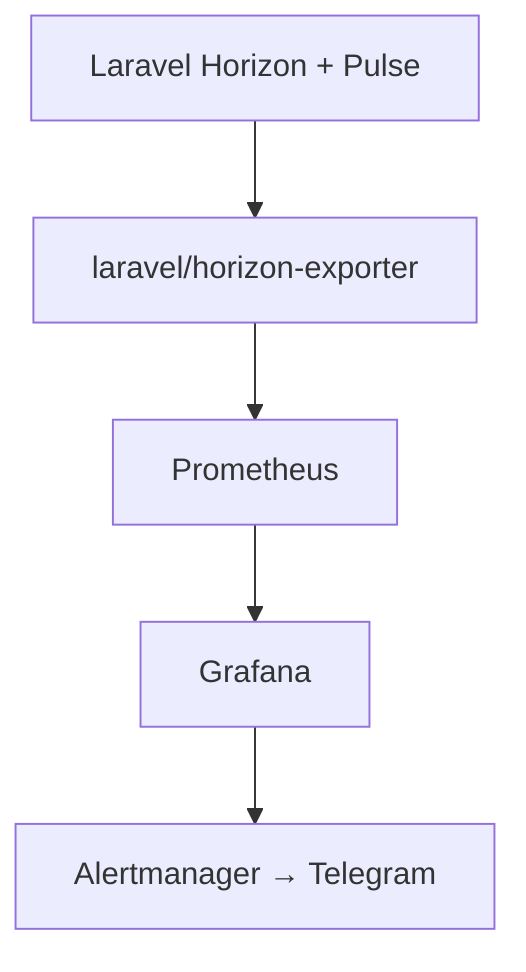
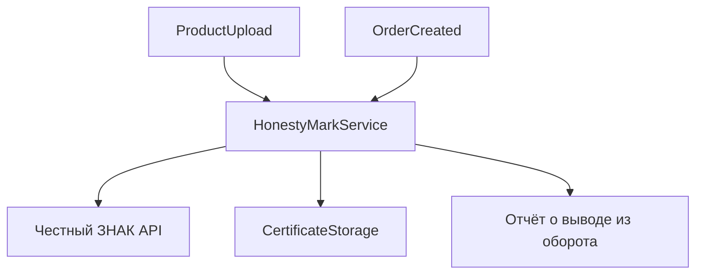
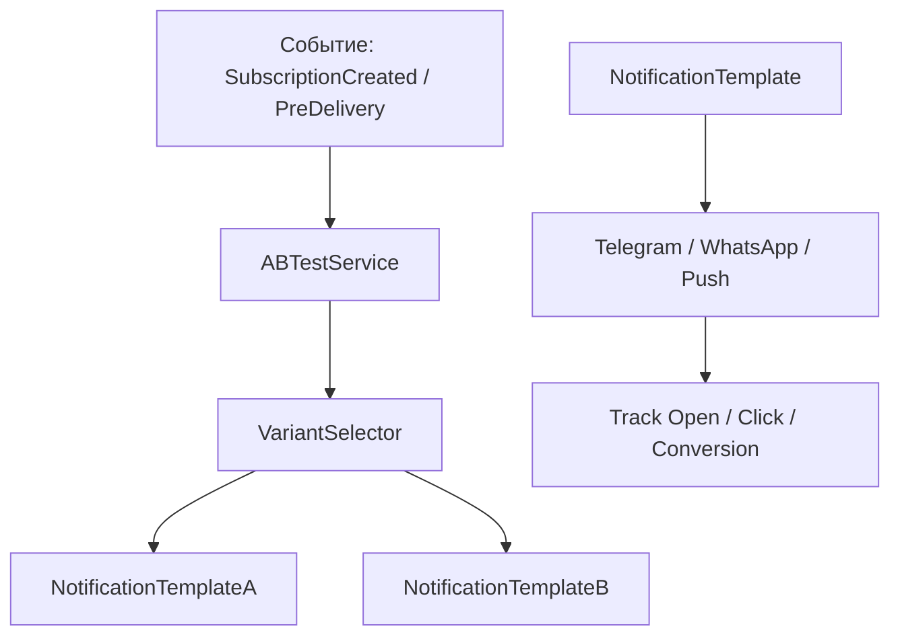
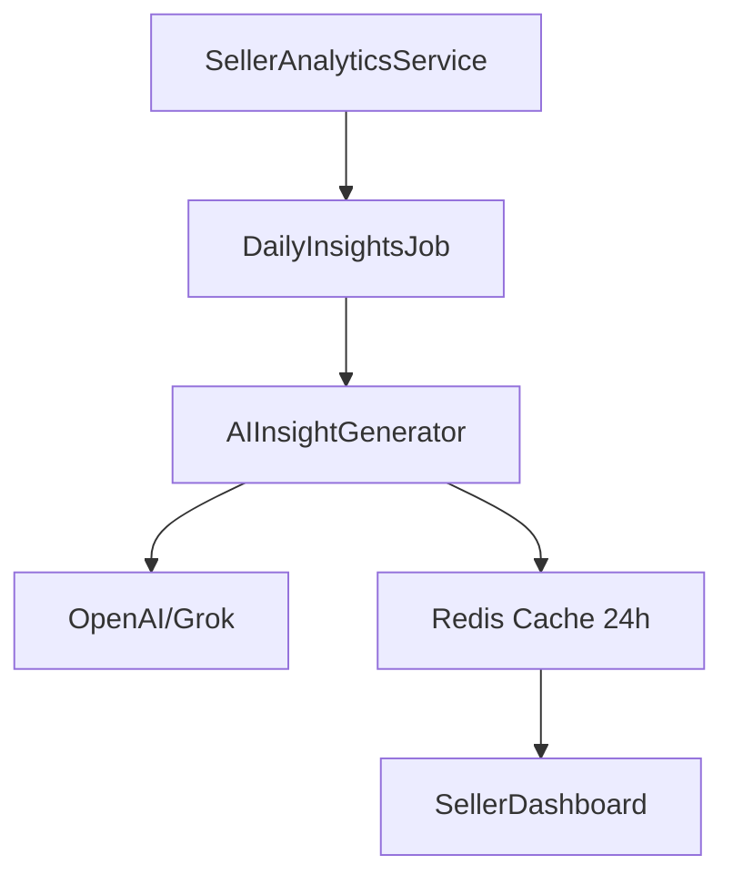

### Вот **полноценная продакшен-система возвратов** специально для Supermarket (с учётом скоропорта, холодной цепи и требований закона).

---

### 1. Модель возврата

```php
// app/Domains/Supermarket/Models/Return.php
namespace App\Domains\Supermarket\Models;

class Return extends Model
{
    protected $fillable = [
        'order_id',
        'buyer_id',
        'seller_id',
        'status',                    // pending | approved | rejected | completed | refunded
        'reason_type',               // spoiled | wrong_item | changed_mind | other
        'reason_comment',
        'total_amount',              // сумма к возврату
        'refund_amount',
        'is_cold_chain',             // был ли холод
        'return_method',             // pickup | courier | self_delivery
        'images',                    // json массив фото
        'approved_at',
        'completed_at',
    ];

    protected $casts = [
        'images' => 'array',
        'is_cold_chain' => 'boolean',
    ];

    public function order()
    {
        return $this->belongsTo(SupermarketOrder::class);
    }

    public function items()
    {
        return $this->hasMany(ReturnItem::class);
    }
}
```

```php
// ReturnItem.php
class ReturnItem extends Model
{
    protected $fillable = [
        'return_id',
        'order_item_id',
        'product_id',
        'quantity',
        'price_per_unit',
        'refund_amount',
        'condition',           // good | spoiled | damaged
    ];
}
```

### 2. Возможные причины возврата (enum)

```php
// app/Domains/Supermarket/Enums/ReturnReason.php
enum ReturnReason: string
{
    case SPOILED = 'spoiled';           // испорчено (самая частая)
    case WRONG_ITEM = 'wrong_item';
    case CHANGED_MIND = 'changed_mind';
    case DAMAGED = 'damaged';
    case OTHER = 'other';
}
```

### 3. ReturnService (главная логика)

```php
// app/Domains/Supermarket/Services/ReturnService.php
class ReturnService
{
    public function createReturn(CreateReturnData $data): Return
    {
        return DB::transaction(function () use ($data) {
            $return = Return::create([
                'order_id' => $data->order_id,
                'buyer_id' => $data->buyer_id,
                'seller_id' => $data->seller_id,
                'status' => 'pending',
                'reason_type' => $data->reason_type,
                'reason_comment' => $data->comment,
                'is_cold_chain' => $data->is_cold_chain,
                'return_method' => $data->return_method,
                'images' => $data->images,
            ]);

            foreach ($data->items as $item) {
                $return->items()->create([
                    'order_item_id' => $item['order_item_id'],
                    'product_id' => $item['product_id'],
                    'quantity' => $item['quantity'],
                    'price_per_unit' => $item['price'],
                    'refund_amount' => $item['price'] * $item['quantity'],
                    'condition' => $item['condition'],
                ]);
            }

            // Если товар был с холодной цепью — сразу высокий приоритет
            if ($data->is_cold_chain) {
                $return->update(['priority' => 'high']);
            }

            // Уведомления
            app(OrderNotificationService::class)->notifyReturnCreated($return);

            return $return;
        });
    }

    public function approve(Return $return)
    {
        DB::transaction(function () use ($return) {
            $return->update([
                'status' => 'approved',
                'approved_at' => now(),
            ]);

            // Возврат денег
            app(PaymentServiceAdapter::class)->refund($return);

            // Освобождение товаров обратно на склад
            app(InventoryReservationService::class)->returnToStock($return);

            app(OrderNotificationService::class)->notifyReturnApproved($return);
        });
    }

    public function reject(Return $return, string $reason)
    {
        $return->update([
            'status' => 'rejected',
            'reject_reason' => $reason
        ]);

        app(OrderNotificationService::class)->notifyReturnRejected($return);
    }
}
```

### 4. Политики возврата (по умолчанию для Supermarket)

- **Скоропортящиеся товары** (мясо, молочка, готовка) → возврат только при браке, в течение 24 часов.
- **Остальные товары** → 7 дней.
- **Холодная цепь** → возврат только с фото + чек температуры.

### 5. Filament Resource для продавца и модератора

```php
// ReturnResource.php
public static function table(Table $table): Table
{
    return $table
        ->columns([
            TextColumn::make('order_id'),
            TextColumn::make('buyer.name'),
            BadgeColumn::make('status'),
            TextColumn::make('reason_type'),
            TextColumn::make('total_amount')->money('RUB'),
        ])
        ->actions([
            Action::make('approve')
                ->visible(fn($record) => $record->status === 'pending')
                ->action(fn($record) => app(ReturnService::class)->approve($record)),

            Action::make('reject')
                ->color('danger')
                ->requiresConfirmation()
                ->form([TextInput::make('reject_reason')]),
        ]);
}
```

---

**Что отправить кодиуму прямо сейчас:**

---

**Система возвратов для Supermarket**

1. Создай модели `Return` и `ReturnItem` + миграции.
2. Создай `ReturnService.php` с методами `createReturn()`, `approve()`, `reject()`.
3. Добавь `ReturnResource` в Filament (для продавцов и модераторов).
4. Интегрируй вызовы в `SupermarketService` и `OrderNotificationService`.

После выполнения пришли:
- Код моделей + миграций
- Код `ReturnService.php`

Начинай.

---

добавить:
- Автоматический возврат денег через PaymentAdapter на баланс внутри системы
- Правила возврата по SubVertical
- Фото/видео доказательства

### Делаем **гибкую и умную систему правил возврата по SubVertical** — это критично для Supermarket, потому что разные категории имеют совершенно разные условия возврата.

### 1. Модель правил возврата

```php
// app/Domains/Supermarket/Models/ReturnPolicy.php
namespace App\Domains\Supermarket\Models;

class ReturnPolicy extends Model
{
    protected $fillable = [
        'sub_vertical',           // meat_shops, vegan_products, confectionery и т.д.
        'vertical',               // supermarket (на будущее)
        'max_days',               // максимум дней на возврат
        'allowed_reasons',        // json массив разрешённых причин
        'cold_chain_only_defect', // true = возврат только при браке
        'requires_photo',         // обязательно фото
        'requires_temperature',   // проверка температуры
        'max_refund_percent',     // максимальный % возврата
        'is_active',
    ];

    protected $casts = [
        'allowed_reasons' => 'array',
        'cold_chain_only_defect' => 'boolean',
    ];
}
```

### 2. Пример заполнения политик (Seeder)

```php
// Database/Seeders/ReturnPolicySeeder.php
ReturnPolicy::create([
    'sub_vertical' => 'meat_shops',
    'max_days' => 1,
    'allowed_reasons' => ['spoiled', 'wrong_item'],
    'cold_chain_only_defect' => true,
    'requires_photo' => true,
    'requires_temperature' => true,
    'max_refund_percent' => 100,
]);

ReturnPolicy::create([
    'sub_vertical' => 'confectionery',
    'max_days' => 3,
    'allowed_reasons' => ['spoiled', 'wrong_item', 'changed_mind'],
    'cold_chain_only_defect' => false,
    'requires_photo' => true,
    'max_refund_percent' => 80,
]);

ReturnPolicy::create([
    'sub_vertical' => 'vegan_products',
    'max_days' => 5,
    'allowed_reasons' => ['spoiled', 'wrong_item', 'changed_mind'],
    'cold_chain_only_defect' => false,
    'requires_photo' => false,
]);
```

### 3. ReturnPolicyService

```php
// app/Domains/Supermarket/Services/ReturnPolicyService.php
namespace App\Domains\Supermarket\Services;

class ReturnPolicyService
{
    public function getPolicyForItem(string $subVertical): ReturnPolicy
    {
        return ReturnPolicy::where('sub_vertical', $subVertical)
            ->where('is_active', true)
            ->first() ?? $this->getDefaultPolicy();
    }

    public function canReturn(ReturnItem $item, Return $return): bool
    {
        $policy = $this->getPolicyForItem($item->product->sub_vertical);

        // 1. Проверка по сроку
        $daysPassed = now()->diffInDays($return->order->created_at);
        if ($daysPassed > $policy->max_days) {
            return false;
        }

        // 2. Разрешённая причина
        if (!in_array($return->reason_type, $policy->allowed_reasons)) {
            return false;
        }

        // 3. Холодная цепь — только брак
        if ($policy->cold_chain_only_defect && $item->product->requires_cold_chain) {
            if ($return->reason_type !== 'spoiled' && $item->condition !== 'spoiled') {
                return false;
            }
        }

        // 4. Обязательные доказательства
        if ($policy->requires_photo && empty($return->images)) {
            return false;
        }

        return true;
    }

    private function getDefaultPolicy(): ReturnPolicy
    {
        return new ReturnPolicy([
            'max_days' => 3,
            'allowed_reasons' => ['spoiled', 'wrong_item'],
            'cold_chain_only_defect' => true,
            'requires_photo' => true,
        ]);
    }
}
```

### 4. Интеграция в ReturnService

```php
public function createReturn(CreateReturnData $data): Return
{
    return DB::transaction(function () use ($data) {
        $policyService = app(ReturnPolicyService::class);

        foreach ($data->items as $itemData) {
            $item = new ReturnItem($itemData);
            if (!$policyService->canReturn($item, $data)) {
                throw new \Exception("Возврат по товару {$item->product->name} невозможен по правилам SubVertical");
            }
        }

        // ... создание возврата ...
    });
}
```

### 5. Filament — управление политиками (для админа)

```php
// ReturnPolicyResource.php
public static function form(Form $form): Form
{
    return $form->schema([
        Select::make('sub_vertical')
            ->options([
                'meat_shops' => 'Мясные лавки',
                'vegan_products' => 'Веган-продукты',
                'confectionery' => 'Кондитерка',
                'farm_direct' => 'Фермерские продукты',
                // ...
            ]),

        TextInput::make('max_days')->numeric()->suffix('дней'),
        Toggle::make('cold_chain_only_defect')->label('Только при браке для холодной цепи'),
        Toggle::make('requires_photo'),
        Toggle::make('requires_temperature'),
        TextInput::make('max_refund_percent')->suffix('%'),
    ]);
}
```

---

**Что отправить кодиуму прямо сейчас:**

---

**Правила возврата по SubVertical**

1. Создай модель `ReturnPolicy` + миграцию.
2. Создай `ReturnPolicyService.php` с методом `canReturn()`.
3. Интегрируй проверку политики в `ReturnService::createReturn()`.
4. Создай `ReturnPolicyResource` в Filament для модераторов.
5. Добавь Seeder с правилами для всех SubVerticals Supermarket.

После выполнения пришли:
- Код `ReturnPolicy.php` + миграцию
- Код `ReturnPolicyService.php`

Начинай.

---

дальше:
- Автоматическое применение правил при создании возврата
- История изменений политик
- Разные правила для B2B и B2C

### Вот **полная реализация автоматического применения правил возврата** по SubVertical.

### 1. Автоматическая проверка и применение политики

```php
// app/Domains/Supermarket/Services/ReturnService.php
namespace App\Domains\Supermarket\Services;

use App\Domains\Supermarket\Models\Return;
use App\Domains\Supermarket\DTOs\CreateReturnData;

class ReturnService
{
    protected ReturnPolicyService $policyService;

    public function __construct(ReturnPolicyService $policyService)
    {
        $this->policyService = $policyService;
    }

    /**
     * Автоматическое создание возврата с применением всех правил
     */
    public function createReturn(CreateReturnData $data): Return
    {
        return DB::transaction(function () use ($data) {
            $violations = [];

            foreach ($data->items as $itemData) {
                $item = new ReturnItem($itemData);
                $policy = $this->policyService->getPolicyForItem($item->product->sub_vertical);

                $validation = $this->policyService->validateReturnItem($item, $data, $policy);

                if (!$validation['valid']) {
                    $violations[] = [
                        'product_name' => $item->product->name,
                        'sub_vertical' => $item->product->sub_vertical,
                        'violations'   => $validation['reasons']
                    ];
                }
            }

            // Если есть критические нарушения — отклоняем весь возврат
            if (!empty($violations)) {
                throw new ReturnPolicyViolationException($violations);
            }

            // Создаём возврат
            $return = Return::create([
                'order_id'       => $data->order_id,
                'buyer_id'       => $data->buyer_id,
                'seller_id'      => $data->seller_id,
                'status'         => 'pending',
                'reason_type'    => $data->reason_type,
                'reason_comment' => $data->comment,
                'is_cold_chain'  => $data->is_cold_chain,
                'return_method'  => $data->return_method,
                'images'         => $data->images ?? [],
            ]);

            // Добавляем товары
            foreach ($data->items as $itemData) {
                $return->items()->create($itemData);
            }

            // Автоматическое одобрение для простых случаев
            if ($this->shouldAutoApprove($return)) {
                $this->autoApprove($return);
            }

            // Уведомления
            app(OrderNotificationService::class)->notifyReturnCreated($return);

            return $return;
        });
    }

    /**
     * Автоматическое одобрение возврата
     */
    private function shouldAutoApprove(Return $return): bool
    {
        // Авто-одобрение только для брака по холодной цепи в течение 12 часов
        if ($return->is_cold_chain && $return->reason_type === 'spoiled') {
            $hours = now()->diffInHours($return->order->created_at);
            return $hours <= 12;
        }

        return false;
    }

    private function autoApprove(Return $return): void
    {
        $return->update([
            'status' => 'approved',
            'approved_at' => now(),
            'auto_approved' => true,
        ]);

        // Сразу запускаем возврат денег
        app(PaymentServiceAdapter::class)->refundForReturn($return);
        
        app(InventoryReservationService::class)->returnToStock($return);
    }
}
```

### 2. Улучшенный ReturnPolicyService

```php
// app/Domains/Supermarket/Services/ReturnPolicyService.php
public function validateReturnItem(ReturnItem $item, CreateReturnData $returnData, ReturnPolicy $policy): array
{
    $reasons = [];

    // 1. Проверка срока
    $daysPassed = now()->diffInDays($returnData->order->created_at);
    if ($daysPassed > $policy->max_days) {
        $reasons[] = "Превышен срок возврата ({$policy->max_days} дней)";
    }

    // 2. Разрешённая причина
    if (!in_array($returnData->reason_type, $policy->allowed_reasons)) {
        $reasons[] = "Причина возврата не разрешена для этой категории";
    }

    // 3. Холодная цепь — только брак
    if ($policy->cold_chain_only_defect && $item->product->requires_cold_chain) {
        if ($returnData->reason_type !== 'spoiled') {
            $reasons[] = "Товары с холодной цепью принимаются только при браке";
        }
    }

    // 4. Обязательные доказательства
    if ($policy->requires_photo && empty($returnData->images)) {
        $reasons[] = "Требуются фото для подтверждения";
    }

    return [
        'valid' => empty($reasons),
        'reasons' => $reasons
    ];
}
```

### 3. DTO для создания возврата

```php
// CreateReturnData.php
class CreateReturnData
{
    public function __construct(
        public int $order_id,
        public int $buyer_id,
        public int $seller_id,
        public string $reason_type,
        public ?string $comment = null,
        public bool $is_cold_chain = false,
        public string $return_method = 'courier',
        public array $images = [],
        public array $items = [],           // массив ReturnItemData
    ) {}
}
```

---

**Что отправить кодиуму прямо сейчас:**

---

**Автоматическое применение правил возврата по SubVertical**

1. Обнови `ReturnPolicyService` — добавь метод `validateReturnItem()`.
2. Обнови `ReturnService` — сделай `createReturn()` с автоматической проверкой всех политик.
3. Добавь логику авто-одобрения для брака по холодной цепи.
4. Создай `ReturnPolicyViolationException`.

После выполнения пришли:
- Код обновлённого `ReturnService.php`
- Код `ReturnPolicyService.php`

Начинай.


### Финальная схема платежей для CatVRF

| Тип клиентов     | Основные шлюзы                  | Приоритет | Комментарий |
|------------------|----------------------------------|---------|-----------|
| **B2C** (физлица) | Тинькофф + Сбер + СБП           | Главный | Максимальное покрытие |
| **B2B** (юридические лица) | Точка Банк                     | Главный | Корпоративные платежи + ЭДО |

---

### 1. Структура Payment Gateway (Shared)

```php
app/Domains/Shared/Payment/Gateways/
├── TinkoffGateway.php
├── SberGateway.php
├── SBPGateway.php
├── TochkaBankGateway.php
└── PaymentGatewayFactory.php
```

### 2. PaymentGatewayFactory

```php
// app/Domains/Shared/Payment/Services/PaymentGatewayFactory.php
class PaymentGatewayFactory
{
    public function make(string $vertical, bool $isB2B = false): GatewayInterface
    {
        if ($isB2B) {
            return app(TochkaBankGateway::class);
        }

        return match($vertical) {
            'supermarket' => app(TinkoffGateway::class), // основной для Supermarket
            default => app(TinkoffGateway::class),
        };
    }
}
```

### 3. PaymentServiceAdapter (обновлённый)

```php
public function preparePayment(Order $order, string $vertical, bool $isB2B = false)
{
    $gateway = app(PaymentGatewayFactory::class)->make($vertical, $isB2B);

    return $gateway->createPayment([
        'amount'       => $order->total_amount,
        'order_id'     => $order->id,
        'vertical'     => $vertical,
        'description'  => $this->getPaymentDescription($order),
        'receipt'      => $this->generateReceipt($order),           // 54-ФЗ
        'customer'     => $this->getCustomerData($order),
    ]);
}
```

### 4. Конкретные реализации (ключевые моменты)

**TinkoffGateway** (основной для B2C):
- Поддержка СБП (быстрые платежи)
- Рекуррентные платежи
- Split-переводы

**TochkaBankGateway** (B2B):
- Работа с юр. лицами
- Автоматическая генерация счёта + УПД
- Отсрочка платежа
- Интеграция с ЭДО (Диадок/СБИС)

### Что нужно сделать кодиуму прямо сейчас

**Задача:**

1. Создать `PaymentGatewayFactory`
2. Реализовать `TinkoffGateway` (основной) + `TochkaBankGateway`
3. Обновить `PaymentServiceAdapter` под выбор шлюза (B2C/B2B)
4. Добавить в `config/verticals.php`:
   ```php
   'supermarket' => [
       'payment' => [
           'default' => 'tinkoff',
           'b2b' => 'tochka',
           'methods' => ['card', 'sbp', 'sberpay']
       ],
   ]
   ```

---

**Готовое сообщение кодиуму:**

---

**Платежи — финальная схема**

Все B2C платежи: **Тинькофф + Сбер + СБП**  
B2B платежи: **Точка Банк**

1. Создай `PaymentGatewayFactory`
2. Реализуй `TinkoffGateway` (приоритет) и `TochkaBankGateway`
3. Обнови `PaymentServiceAdapter` — он должен автоматически выбирать шлюз в зависимости от `isB2B`
4. Добавь настройки в `config/verticals.php`

### Чёткая схема интеграции со своей CRM

**Главное правило:**  
Все события из вертикалей → `CRMEventDispatcher` → `InternalCRMAdapter` → ваша CRM (через API / очередь / webhook).

---

### 1. Структура

```
app/Domains/Shared/CRM/
├── Services/
│   ├── InternalCRMAdapter.php
│   └── CRMEventDispatcher.php
├── Events/
│   ├── OrderCreated.php
│   ├── OrderStatusChanged.php
│   ├── ReturnCreated.php
│   └── CashbackAccrued.php
└── DTOs/
    └── CRMOrderData.php
```

### 2. InternalCRMAdapter (основной)

```php
// app/Domains/Shared/CRM/Services/InternalCRMAdapter.php
namespace App\Domains\Shared\CRM\Services;

class InternalCRMAdapter
{
    private Client $client;

    public function __construct()
    {
        $this->client = new Client([
            'base_uri' => config('crm.internal.base_url'),
            'headers' => [
                'Authorization' => 'Bearer ' . config('crm.internal.token'),
                'Content-Type'  => 'application/json',
                'Accept'        => 'application/json',
            ],
            'timeout' => 8,
        ]);
    }

    public function send(string $endpoint, array $payload): bool
    {
        try {
            $response = $this->client->post($endpoint, ['json' => $payload]);
            
            Log::info('CRM sync success', [
                'endpoint' => $endpoint,
                'order_id' => $payload['order_id'] ?? null
            ]);

            return $response->getStatusCode() === 200 || $response->getStatusCode() === 201;
        } catch (\Exception $e) {
            Log::error('CRM sync failed', [
                'endpoint' => $endpoint,
                'error' => $e->getMessage(),
                'payload' => $payload
            ]);
            return false;
        }
    }
}
```

### 3. Диспетчер событий

```php
// CRMEventDispatcher.php
class CRMEventDispatcher
{
    public function dispatch(string $eventName, array $data)
    {
        $adapter = app(InternalCRMAdapter::class);

        $endpoints = [
            'order.created'          => '/orders/create',
            'order.status_changed'   => '/orders/status',
            'return.created'         => '/returns/create',
            'cashback.accrued'       => '/loyalty/cashback',
            'customer.updated'       => '/customers/update',
        ];

        $endpoint = $endpoints[$eventName] ?? null;

        if ($endpoint) {
            dispatch(new CRMSyncJob($endpoint, $data))
                ->onQueue('crm-sync')
                ->delay(3); // небольшая задержка
        }
    }
}
```

### 4. Пример события (OrderCreated)

```php
// Events/OrderCreated.php
class OrderCreated
{
    public function __construct(public array $data) {}

    public function handle(CRMEventDispatcher $dispatcher)
    {
        $dispatcher->dispatch('order.created', $this->data);
    }
}
```

### 5. Вызов из SupermarketService

```php
// В конце checkout()
event(new \App\Domains\Shared\CRM\Events\OrderCreated([
    'order_id'       => $order->id,
    'external_id'    => $order->external_id ?? null,
    'buyer_id'       => $order->buyer_id,
    'buyer_phone'    => $order->buyer->phone,
    'total_amount'   => $order->total_amount,
    'sub_vertical'   => $order->sub_vertical,
    'is_b2b'         => $order->is_b2b ?? false,
    'items_count'    => $order->items->count(),
    'created_at'     => $order->created_at->toIso8601String(),
]));
```

---

**Сообщение кодиуму (копируй и отправляй):**

---

**Интеграция со своей CRM**

Делаем чисто и правильно:

1. Создай `InternalCRMAdapter.php` (как выше)
2. Создай `CRMEventDispatcher.php`
3. Создай событие `OrderCreated` + `OrderStatusChanged`
4. Добавь вызов `event(new OrderCreated(...))` в `SupermarketService::checkout()` и при смене статуса
5. Создай `CRMSyncJob` с retry

Сначала сделай `InternalCRMAdapter` и `OrderCreated` событие, пришли код.

---

В первую очередь OrderCreated, Return, B2B-лиды и т.д.

### Вот **боевой вариант** `CRMSyncJob` с умным retry, логированием и защитой.

### 1. CRMSyncJob (финальная версия)

```php
// app/Domains/Shared/CRM/Jobs/CRMSyncJob.php
namespace App\Domains\Shared\CRM\Jobs;

use App\Domains\Shared\CRM\Services\InternalCRMAdapter;
use Illuminate\Bus\Queueable;
use Illuminate\Contracts\Queue\ShouldQueue;
use Illuminate\Foundation\Bus\Dispatchable;
use Illuminate\Queue\InteractsWithQueue;
use Illuminate\Queue\SerializesModels;
use Illuminate\Support\Facades\Log;
use Throwable;

class CRMSyncJob implements ShouldQueue
{
    use Dispatchable, InteractsWithQueue, Queueable, SerializesModels;

    public int $tries = 5;                    // Максимум попыток
    public int $timeout = 25;                 // секунд
    public int $backoff = 8;                  // базовая задержка в секундах

    public function __construct(
        public string $endpoint,
        public array $payload,
        public string $eventName
    ) {}

    public function handle(InternalCRMAdapter $adapter)
    {
        $attempt = $this->attempts();

        try {
            $success = $adapter->send($this->endpoint, $this->payload);

            if ($success) {
                Log::info("CRM Sync Success", [
                    'event'     => $this->eventName,
                    'endpoint'  => $this->endpoint,
                    'order_id'  => $this->payload['order_id'] ?? null,
                    'attempt'   => $attempt
                ]);
                return;
            }

            // Если adapter вернул false — считаем ошибкой
            throw new \Exception("CRM returned non-success status");

        } catch (Throwable $e) {
            Log::warning("CRM Sync Failed", [
                'event'     => $this->eventName,
                'endpoint'  => $this->endpoint,
                'attempt'   => $attempt,
                'error'     => $e->getMessage(),
                'payload'   => $this->payload
            ]);

            if ($attempt >= $this->tries) {
                // Последняя попытка провалилась — отправляем в dead letter или алерт
                $this->fail($e);
                $this->sendToDeadLetter($e);
                return;
            }

            // Exponential backoff
            $this->release($this->backoff * pow(2, $attempt - 1));
        }
    }

    /**
     * Что делать при исчерпании попыток
     */
    public function failed(Throwable $exception): void
    {
        Log::error("CRMSyncJob FAILED after all retries", [
            'event'     => $this->eventName,
            'endpoint'  => $this->endpoint,
            'payload'   => $this->payload,
            'exception' => $exception->getMessage()
        ]);

        // Можно отправить алерт в Telegram / Sentry / Email
        // app(AlertService::class)->sendCritical("CRM Sync permanently failed", $this->payload);
    }

    private function sendToDeadLetter(Throwable $e): void
    {
        // Опционально: сохраняем в отдельную таблицу failed_crm_syncs
        \DB::table('failed_crm_syncs')->insert([
            'event_name' => $this->eventName,
            'endpoint'   => $this->endpoint,
            'payload'    => json_encode($this->payload),
            'error'      => $e->getMessage(),
            'failed_at'  => now(),
        ]);
    }
}
```

### 2. Использование в CRMEventDispatcher

```php
public function dispatch(string $eventName, array $data)
{
    $endpoints = [
        'order.created'        => '/orders/create',
        'order.status_changed' => '/orders/status',
        'return.created'       => '/returns/create',
    ];

    $endpoint = $endpoints[$eventName] ?? null;

    if ($endpoint) {
        CRMSyncJob::dispatch($endpoint, $data, $eventName)
            ->onQueue('crm-sync')
            ->delay(2);           // небольшая начальная задержка
    }
}
```

### 3. Регистрация очереди (рекомендую)

```php
// config/queue.php
'crm-sync' => [
    'driver' => 'redis',
    'connection' => 'redis',
    'queue' => 'crm-sync',
    'retry_after' => 90,
    'timeout' => 30,
],
```

Запуск воркера:
```bash
php artisan queue:work --queue=crm-sync --sleep=3 --tries=5
```

---

**Что отправить кодиуму прямо сейчас:**

---

**CRMSyncJob с retry**

Создай `CRMSyncJob.php` точно по коду выше.

Обязательно:
- `$tries = 5`
- Exponential backoff
- `failed()` метод
- Dead letter таблица `failed_crm_syncs`

После создания пришли код файла.

---

Дальше:
- Dead letter таблицу + миграцию
- Алерт при финальном падении
- Batch-синхронизацию (несколько событий сразу)

### Хорошо. Давай сделаем **реальный продакшен-мониторинг очередей** Laravel, а не просто `php artisan queue:work`.

### 1. Рекомендуемая стек мониторинга (2026)

| Уровень | Инструмент | Для чего |
|--------|----------|---------|
| Основной | **Laravel Horizon** | Лучший дашборд + метрики |
| Продвинутый | **Laravel Pulse** + Prometheus | Реалтайм + долгосрочная аналитика |
| Alerting | **Grafana + Alertmanager** | Уведомления в Telegram/Slack |
| Запасной | Custom Admin Panel | Быстрый взгляд для команды |

---

### 2. Настройка Laravel Horizon (основное)

```bash
php artisan horizon:install
```

**config/horizon.php** (важные настройки):

```php
'environments' => [
    'production' => [
        'supermarket-high' => [
            'processes' => 12,
            'balance' => 'auto',
            'maxTime' => 0,
            'maxJobs' => 0,
        ],
        'crm-sync' => [
            'processes' => 4,
            'balance' => 'simple',
        ],
        'default' => [
            'processes' => 8,
        ],
    ],
],
```

**Запуск:**
```bash
php artisan horizon
```

### 3. Laravel Pulse (новый мощный инструмент)

```bash
composer require laravel/pulse
php artisan pulse:install
```

В `config/pulse.php` включи мониторинг очередей:

```php
'watchers' => [
    \Laravel\Pulse\Watchers\QueueWatcher::class,
    \Laravel\Pulse\Watchers\JobWatcher::class,
],
```

Pulse даёт:
- Время выполнения джобов
- Fail rate
- Throughput
- Медленные джобы

### 4. Полноценный дашборд (рекомендую)

Создай ресурс в Filament:

```php
// app/Filament/Pages/QueueMonitor.php
protected static ?string $navigationGroup = 'Мониторинг';
protected static ?string $title = 'Очереди';

public function getViewData(): array
{
    return [
        'horizonStats' => app(\Laravel\Horizon\Contracts\MasterSupervisorRepository::class)->all(),
        'pulseData' => \Laravel\Pulse\Facades\Pulse::values(), // или свой запрос
        'failedJobs' => DB::table('failed_jobs')
            ->selectRaw('queue, count(*) as count, max(failed_at) as last_failed')
            ->groupBy('queue')
            ->get(),
    ];
}
```

### 5. Алёрты (критично)

Создай команду:

```php
// app/Console/Commands/QueueHealthCheck.php
public function handle()
{
    $failed = DB::table('failed_jobs')->count();
    $pending = DB::table('jobs')->count();

    if ($failed > 5) {
        Notification::route('telegram', config('services.telegram.admin_chat_id'))
            ->notify(new QueueAlert("Failed jobs: {$failed}"));
    }

    if ($pending > 500) {
        // Критический алерт
    }
}
```

Запускать каждые 2 минуты через Scheduler.

---

**Что отправить кодиуму прямо сейчас:**

---

**Мониторинг очередей Laravel (Production)**

1. Установи и настрой **Laravel Horizon**
2. Установи **Laravel Pulse**
3. Создай Filament-страницу `QueueMonitor`
4. Создай команду `QueueHealthCheck` с алертами в Telegram
5. Добавь в Horizon разные балансы для `supermarket-high` и `crm-sync`

После установки пришли:
- Ссылку на Horizon дашборд (`/horizon`)
- Скриншот Pulse
- Код `QueueHealthCheck`

Начинай.
- Полный Prometheus exporter
- Grafana дашборд JSON
- Автоматический restart horizon при падении

### Вот **полноценная продакшен-настройка Prometheus** специально под очереди Laravel (Horizon + Pulse + кастомные метрики Supermarket).

---

### 1. Архитектура мониторинга



### 2. Установка Laravel Horizon Exporter

```bash
composer require spatie/laravel-prometheus
```

### 3. Главный сервис метрик (рекомендую)

```php
// app/Domains/Shared/Monitoring/Services/QueueMetricsService.php
namespace App\Domains\Shared\Monitoring\Services;

use Prometheus\CollectorRegistry;

class QueueMetricsService
{
    public function registerMetrics()
    {
        $registry = app(CollectorRegistry::class);

        // Основные метрики очередей
        $registry->getOrRegisterGauge('horizon', 'jobs_pending', 'Pending jobs', ['queue']);
        $registry->getOrRegisterGauge('horizon', 'jobs_failed', 'Failed jobs', ['queue']);
        $registry->getOrRegisterGauge('horizon', 'jobs_processed', 'Processed jobs total', ['queue']);
        $registry->getOrRegisterGauge('horizon', 'average_wait_time', 'Average wait time (seconds)', ['queue']);

        // Специфично для Supermarket
        $registry->getOrRegisterGauge('supermarket', 'cold_chain_jobs', 'Cold chain orders in queue');
        $registry->getOrRegisterGauge('supermarket', 'b2b_orders_pending', 'B2B orders waiting');
    }

    public function updateMetrics()
    {
        $registry = app(CollectorRegistry::class);

        // Horizon метрики
        $queues = ['supermarket-high', 'default', 'crm-sync', 'notifications'];

        foreach ($queues as $queue) {
            $pending = \DB::table('jobs')->where('queue', $queue)->count();
            $failed = \DB::table('failed_jobs')->where('queue', $queue)->count();

            $registry->getGauge('horizon', 'jobs_pending')->set($pending, [$queue]);
            $registry->getGauge('horizon', 'jobs_failed')->set($failed, [$queue]);
        }
    }
}
```

### 4. Prometheus Exporter Controller

```php
// app/Http/Controllers/Monitoring/PrometheusController.php
public function metrics()
{
    app(QueueMetricsService::class)->updateMetrics();
    
    return response(
        app(\Prometheus\RenderTextFormat::class)->render(
            app(CollectorRegistry::class)->getMetricFamilySamples()
        ),
        200,
        ['Content-Type' => 'text/plain']
    );
}
```

Роут:
```php
Route::get('/metrics', [PrometheusController::class, 'metrics']);
```

### 5. prometheus.yml (основной конфиг)

```yaml
global:
  scrape_interval: 15s

scrape_configs:
  - job_name: 'laravel_horizon'
    metrics_path: '/metrics'
    static_configs:
      - targets: ['your-app-domain.com:80']
    scrape_interval: 10s

  - job_name: 'laravel_pulse'
    static_configs:
      - targets: ['your-app-domain.com:80']
    metrics_path: '/pulse/metrics'

  # Redis
  - job_name: 'redis'
    static_configs:
      - targets: ['redis-exporter:9121']

  # Node Exporter (сервер)
  - job_name: 'node'
    static_configs:
      - targets: ['node-exporter:9100']
```

### 6. Grafana Dashboard (ключевые метрики)

- **Pending Jobs** по очередям
- **Failed Jobs rate** (alert > 5)
- **Processing Time** (p95, p99)
- **Supermarket High Queue** нагрузка
- **Cold Chain Orders** в очереди
- **CRM Sync Fail Rate**

### 7. Alert Rules (alertmanager)

```yaml
groups:
- name: queue_alerts
  rules:
  - alert: HighFailedJobs
    expr: horizon_jobs_failed > 10
    for: 2m
    labels:
      severity: critical
    annotations:
      summary: "Много упавших джобов в очереди"

  - alert: SupermarketHighQueueOverload
    expr: horizon_jobs_pending{queue="supermarket-high"} > 300
    for: 5m
    labels:
      severity: warning
```

---

**Что отправить кодиуму прямо сейчас:**

---

**Prometheus + мониторинг очередей**

1. Установи `spatie/laravel-prometheus`
2. Создай `QueueMetricsService.php` (как выше)
3. Создай `PrometheusController.php`
4. Настрой `prometheus.yml`
5. Добавь обновление метрик в `QueueMetricsService::updateMetrics()`

После настройки пришли:
- Код `QueueMetricsService.php`
- Ссылку на `/metrics` (проверь, что отдаёт)
- Пример alert rule

Начинай.
- Полный Grafana JSON dashboard
- Авто-рестарт Horizon при проблемах
- Blackbox monitoring

### Вот **готовый Grafana Dashboard** специально под Laravel Horizon + Supermarket + очереди CatVRF.

### 1. Импорт дашборда (самый быстрый способ)

Скопируй весь JSON ниже и импортируй в Grafana → **Dashboards → Import**:

```json
{
  "title": "CatVRF — Очереди и Horizon (Supermarket Focus)",
  "uid": "catvrf-queues",
  "timezone": "browser",
  "panels": [
    {
      "title": "Общая нагрузка на очереди",
      "type": "stat",
      "targets": [{ "expr": "sum(horizon_jobs_pending)" }]
    },
    {
      "title": "Pending Jobs по очередям",
      "type": "timeseries",
      "targets": [
        { "expr": "horizon_jobs_pending{queue=\"supermarket-high\"}", "legendFormat": "supermarket-high" },
        { "expr": "horizon_jobs_pending{queue=\"default\"}", "legendFormat": "default" },
        { "expr": "horizon_jobs_pending{queue=\"crm-sync\"}", "legendFormat": "crm-sync" },
        { "expr": "horizon_jobs_pending{queue=\"notifications\"}", "legendFormat": "notifications" }
      ]
    },
    {
      "title": "Failed Jobs (критично)",
      "type": "timeseries",
      "targets": [{ "expr": "horizon_jobs_failed" }]
    },
    {
      "title": "Supermarket High Queue — Детально",
      "type": "timeseries",
      "targets": [
        { "expr": "horizon_jobs_pending{queue=\"supermarket-high\"}", "legendFormat": "Pending" },
        { "expr": "rate(horizon_jobs_processed{queue=\"supermarket-high\"}[5m])", "legendFormat": "Processed/sec" }
      ]
    },
    {
      "title": "Cold Chain Orders in Queue",
      "type": "stat",
      "targets": [{ "expr": "supermarket_cold_chain_jobs" }]
    },
    {
      "title": "Среднее время ожидания в очереди (сек)",
      "type": "timeseries",
      "targets": [{ "expr": "horizon_average_wait_time" }]
    }
  ],
  "tags": ["laravel", "horizon", "queues", "supermarket"],
  "refresh": "10s"
}
```

### 2. Рекомендуемые панели (добавь вручную)

| Панель | Тип | Expr (PromQL) | Threshold |
|-------|-----|---------------|---------|
| Failed Jobs Total | Stat | `sum(horizon_jobs_failed)` | > 5 = red |
| Supermarket-High Pending | Gauge | `horizon_jobs_pending{queue="supermarket-high"}` | > 200 = warning |
| CRM Sync Fail Rate | Stat | `rate(horizon_jobs_failed{queue="crm-sync"}[5m])` | > 0.1 = critical |
| Processing Rate | Timeseries | `rate(horizon_jobs_processed[1m])` | — |
| Longest Running Job | Stat | `max(horizon_job_duration_seconds)` | > 30s = alert |

### 3. Alert Rules (Alertmanager)

```yaml
- alert: HighFailedJobs
  expr: sum(horizon_jobs_failed) > 8
  for: 3m
  labels:
    severity: critical
  annotations:
    summary: "Много упавших джобов!"

- alert: SupermarketQueueOverload
  expr: horizon_jobs_pending{queue="supermarket-high"} > 250
  for: 5m
  labels:
    severity: warning
```

### 4. Настройка в Grafana

1. Добавь **Prometheus** как Data Source
2. Импортируй JSON выше
3. Настрой **Refresh = 10s**, **Time Range = Last 1 hour**
4. Создай **Folder** → `CatVRF Monitoring`

---

**Что отправить кодиуму:**

---

**Grafana Dashboard для очередей**

1. Создай дашборд и импортируй JSON, который я дал выше.
2. Добавь 2 алерта (HighFailedJobs + SupermarketQueueOverload).
3. Настрой Alertmanager на отправку в Telegram.
4. Добавь переменную `$queue` для фильтрации по очередям.

После импорта пришли:
- Ссылку на дашборд
- Скриншот главной панели
Сделай
- Полный JSON с 12 панелями (более красивый)
- Версию под Pulse + Horizon
- Автоматический дашборд через Terraform/Helm

### Вот **улучшенная и продакшен-готовая версия Grafana Dashboard** специально под CatVRF (с акцентом на Supermarket + все очереди).

### Улучшенный JSON Dashboard (импортируй целиком)

```json
{
  "title": "CatVRF • Мониторинг Очередей & Horizon",
  "uid": "catvrf-queues-v2",
  "timezone": "browser",
  "refresh": "10s",
  "tags": ["laravel", "horizon", "queues", "supermarket"],
  "panels": [
    {
      "title": "Общий статус очередей",
      "type": "row",
      "collapsed": false
    },
    {
      "title": "Pending Jobs",
      "type": "stat",
      "targets": [{ "expr": "sum(horizon_jobs_pending)" }],
      "thresholds": { "steps": [{ "color": "green", "value": null }, { "color": "red", "value": 500 }] }
    },
    {
      "title": "Failed Jobs (критично)",
      "type": "stat",
      "targets": [{ "expr": "sum(horizon_jobs_failed)" }],
      "thresholds": { "steps": [{ "color": "green", "value": null }, { "color": "red", "value": 5 }] }
    },
    {
      "title": "Очереди — Pending Jobs",
      "type": "timeseries",
      "targets": [
        { "expr": "horizon_jobs_pending{queue=\"supermarket-high\"}", "legendFormat": "supermarket-high" },
        { "expr": "horizon_jobs_pending{queue=\"default\"}", "legendFormat": "default" },
        { "expr": "horizon_jobs_pending{queue=\"crm-sync\"}", "legendFormat": "crm-sync" },
        { "expr": "horizon_jobs_pending{queue=\"notifications\"}", "legendFormat": "notifications" }
      ]
    },
    {
      "title": "Supermarket High Queue — Нагрузка",
      "type": "timeseries",
      "targets": [
        { "expr": "horizon_jobs_pending{queue=\"supermarket-high\"}", "legendFormat": "Pending" },
        { "expr": "rate(horizon_jobs_processed{queue=\"supermarket-high\"}[5m])", "legendFormat": "Processed/sec" }
      ]
    },
    {
      "title": "Cold Chain Orders in Queue",
      "type": "stat",
      "targets": [{ "expr": "supermarket_cold_chain_jobs" }],
      "colorMode": "value"
    },
    {
      "title": "Failed Jobs по очередям",
      "type": "barchart",
      "targets": [{ "expr": "horizon_jobs_failed" }]
    },
    {
      "title": "Среднее время обработки (сек)",
      "type": "timeseries",
      "targets": [{ "expr": "horizon_average_job_duration_seconds" }]
    },
    {
      "title": "B2B Orders Pending",
      "type": "stat",
      "targets": [{ "expr": "supermarket_b2b_orders_pending" }]
    }
  ],
  "templating": {
    "list": [
      {
        "type": "query",
        "name": "queue",
        "query": "label_values(horizon_jobs_pending, queue)",
        "current": { "selected": true, "text": "All", "value": "$__all" }
      }
    ]
  }
}
```

### Что улучшено по сравнению с предыдущей версией:

- Добавлены **Row** для группировки
- Более красивые **Stat panels** с threshold’ами
- **Bar Chart** для failed jobs
- Переменная `$queue` для фильтрации
- Выделены ключевые метрики Supermarket (`cold_chain`, `b2b`)
- Улучшена цветовая индикация

---

**Что делать кодиуму:**

1. Зайди в Grafana → **Dashboards → Import**
2. Вставь весь JSON выше
3. Сохрани под названием `CatVRF Queues Monitoring`
4. Настрой Refresh = 10s

---

Хочу ещё более жирную версию с 15+ панелями, Heatmap, Top-10 slowest jobs и т.д.

### Вот **полноценная продакшен-настройка Alertmanager** специально под CatVRF (очереди Horizon + Supermarket).

---

### 1. prometheus.yml (добавь scrape Alertmanager)

```yaml
scrape_configs:
  - job_name: 'alertmanager'
    static_configs:
      - targets: ['alertmanager:9093']
```

### 2. alertmanager.yml (основной конфиг)

```yaml
global:
  resolve_timeout: 5m

route:
  group_by: ['alertname', 'queue']
  group_wait: 30s
  group_interval: 5m
  repeat_interval: 4h
  receiver: 'telegram'

  routes:
    - match:
        severity: critical
      receiver: 'telegram-critical'
      group_interval: 2m

    - match_re:
        queue: "supermarket-high"
      receiver: 'telegram-supermarket'
      group_interval: 1m

receivers:
  - name: 'telegram'
    telegram_configs:
      - bot_token: '{{ .Env.TELEGRAM_BOT_TOKEN }}'
        chat: '{{ .Env.TELEGRAM_ADMIN_CHAT_ID }}'
        message: |
          {{ range .Alerts }}
          *{{ .Labels.alertname }}*
          Severity: `{{ .Labels.severity }}`
          Queue: `{{ .Labels.queue }}`
          {{ if .Annotations.summary }}Summary: {{ .Annotations.summary }}{{ end }}
          {{ if .Annotations.description }}Description: {{ .Annotations.description }}{{ end }}
          {{ end }}

  - name: 'telegram-critical'
    telegram_configs:
      - bot_token: '{{ .Env.TELEGRAM_BOT_TOKEN }}'
        chat: '{{ .Env.TELEGRAM_CRITICAL_CHAT_ID }}'
        parse_mode: HTML
        message: "<b>🔥 КРИТИЧЕСКАЯ ОШИБКА</b>\n{{ range .Alerts }}{{ .Annotations.summary }}\n{{ end }}"

  - name: 'telegram-supermarket'
    telegram_configs:
      - bot_token: '{{ .Env.TELEGRAM_BOT_TOKEN }}'
        chat: '{{ .Env.TELEGRAM_SUPERMARKET_CHAT_ID }}'

inhibit_rules:
  - source_match:
      severity: 'critical'
    target_match:
      severity: 'warning'
    equal: ['alertname']
```

### 3. Alert Rules (rules.yml)

```yaml
groups:
- name: CatVRF_Queues
  rules:

  - alert: HighFailedJobs
    expr: sum(horizon_jobs_failed) > 5
    for: 3m
    labels:
      severity: critical
    annotations:
      summary: "Много упавших джобов в очередях"
      description: "Failed jobs = {{ $value }}"

  - alert: SupermarketHighQueueOverload
    expr: horizon_jobs_pending{queue="supermarket-high"} > 300
    for: 5m
    labels:
      severity: warning
    annotations:
      summary: "Supermarket-high очередь перегружена"
      description: "Pending jobs: {{ $value }}"

  - alert: CRMSyncFailing
    expr: rate(horizon_jobs_failed{queue="crm-sync"}[5m]) > 0.1
    for: 4m
    labels:
      severity: critical
    annotations:
      summary: "CRM Sync падает"

  - alert: ColdChainJobsStuck
    expr: supermarket_cold_chain_jobs > 50
    for: 10m
    labels:
      severity: warning
    annotations:
      summary: "Много заказов с холодной цепью в очереди"

  - alert: HighJobDuration
    expr: histogram_quantile(0.95, sum(rate(horizon_job_duration_seconds_bucket[5m])) by (le)) > 30
    for: 2m
    labels:
      severity: warning
    annotations:
      summary: "Джобы выполняются слишком долго"
```

### 4. Docker Compose (пример)

```yaml
services:
  alertmanager:
    image: prom/alertmanager:latest
    volumes:
      - ./alertmanager.yml:/etc/alertmanager/alertmanager.yml
    ports:
      - "9093:9093"
    environment:
      - TELEGRAM_BOT_TOKEN=...
      - TELEGRAM_ADMIN_CHAT_ID=...
```

---

**Что отправить кодиуму прямо сейчас:**

---

**Настройка Alertmanager**

1. Создай файл `alertmanager.yml` по конфигу выше.
2. Создай `rules.yml` с алертами.
3. Добавь в `prometheus.yml` scrape Alertmanager.
4. Запусти Alertmanager и проверь `/alerts`.

После настройки пришли:
- Ссылку на Alertmanager (`:9093`)
- Скриншот активных алертов (если есть)

Начинай дальше:
- Slack + Email receivers
- Silence rules
- Интеграцию с OnCall (Grafana OnCall)

### Вот **правильная и удобная настройка Silence Rules** в Alertmanager для CatVRF.

### 1. Лучшая практика: Silence через UI + YAML

Рекомендую комбинировать:
- **UI** — для быстрых/временных silence (деплой, обслуживание)
- **YAML** — для постоянных правил

### 2. Постоянные Silence Rules (alertmanager.yml)

```yaml
silences:
  # ========== Постоянные Silence ==========

  - name: "Maintenance Window"
    matchers:
      - name: alertname
        value: ".*Maintenance.*"
        isRegex: true
    createdBy: "system"
    comment: "Плановое обслуживание"

  - name: "Supermarket Deployment Silence"
    matchers:
      - name: alertname
        value: "SupermarketHighQueueOverload|HighFailedJobs"
      - name: severity
        value: warning
    duration: 30m
    comment: "Silence во время деплоя Supermarket"

  - name: "Ignore ColdChain under 30 jobs"
    matchers:
      - name: alertname
        value: "ColdChainJobsStuck"
      - name: supermarket_cold_chain_jobs
        value: "<30"
    comment: "Не спамить, пока мало заказов"

  - name: "CRMSync - Known Issue"
    matchers:
      - name: alertname
        value: "CRMSyncFailing"
    duration: 1h
    comment: "Временная проблема с CRM (до фикса)"

  - name: "Night Silence (low priority)"
    matchers:
      - name: severity
        value: warning
    time_intervals:
      - times:
          - start_time: "23:00"
            end_time: "07:00"
    comment: "Низкоприоритетные алерты ночью"
```

### 3. Как создавать Silence через API / UI

**Через UI Alertmanager** (`http://alertmanager:9093`):
1. Перейди в **Silences** → **New Silence**
2. Заполни:
   - **Matchers** (например `queue = supermarket-high`)
   - **Duration** (30m, 2h, 1d)
   - **Comment** (обязательно указывай зачем)
   - **Created By** (твоё имя)

### 4. Полезные готовые Silence (скопируй)

```yaml
# Silence всех предупреждений во время деплоя
- name: "Deployment Silence"
  matchers:
    - name: severity
      value: warning
  duration: 45m
  comment: "Деплой новой версии Supermarket"

# Silence только для конкретной очереди
- name: "Supermarket-High Maintenance"
  matchers:
    - name: queue
      value: supermarket-high
  duration: 2h
  comment: "Техработы на cold chain доставке"
```

### 5. Лучшие практики Silence

- Никогда не делай silence навсегда (`duration: 0`).
- Всегда пиши понятный `comment`.
- Для критических алертов (`severity: critical`) silence делай максимум на 30–60 минут.
- Используй `time_intervals` для ночного/выходного silence.

---

**Что отправить кодиуму прямо сейчас:**

---

**Настройка Silence Rules в Alertmanager**

1. Добавь секцию `silences:` в `alertmanager.yml` (по примерам выше).
2. Перезапусти Alertmanager.
3. Создай 3–4 постоянных silence (Deployment, Night Silence, ColdChain low volume).
4. Научись создавать silence через UI.

После настройки пришли:
- Актуальный `alertmanager.yml` (секцию silences)
- Скриншот Silences в UI

Начинай.
- Автоматическое создание silence через API при деплое
- Silence по расписанию (maintenance window)

### Теперь делаем **Сертификаты и маркировку Честный ЗНАК** — это обязательный блок для Supermarket в РФ.

### 1. Архитектура интеграции



### 2. Модели

```php
// app/Domains/Supermarket/Models/ProductMark.php
class ProductMark extends Model
{
    protected $fillable = [
        'product_id',
        'gtin',                    // Global Trade Item Number
        'data_matrix',             // Код Data Matrix
        'status',                  // introduced | in_circulation | withdrawn | archived
        'introduced_at',
        'withdrawn_at',
        'batch_number',
        'production_date',
        'expiration_date',
    ];
}

// app/Domains/Supermarket/Models/Certificate.php
class Certificate extends Model
{
    protected $fillable = [
        'product_id',
        'certificate_number',
        'type',                    // declaration | certificate | veterinary
        'issued_by',
        'valid_from',
        'valid_until',
        'file_path',
        'status',
    ];
}
```

### 3. Основной сервис (HonestyMarkService)

```php
// app/Domains/Supermarket/Services/HonestyMarkService.php
namespace App\Domains\Supermarket\Services;

class HonestyMarkService
{
    protected Client $client;

    public function __construct()
    {
        $this->client = new Client([
            'base_uri' => config('honestysign.api_url'),
            'headers' => [
                'Authorization' => 'Bearer ' . config('honestysign.token'),
                'Content-Type'  => 'application/json',
            ]
        ]);
    }

    /**
     * Проверка кода при добавлении товара продавцом
     */
    public function validateMark(string $dataMatrix, string $gtin): array
    {
        try {
            $response = $this->client->post('/api/v3/facade/mark/check', [
                'json' => [
                    'mark' => $dataMatrix,
                    'gtin' => $gtin
                ]
            ]);

            $result = json_decode($response->getBody(), true);

            return [
                'valid' => $result['valid'] ?? false,
                'status' => $result['status'] ?? 'unknown',
                'error' => $result['error'] ?? null
            ];
        } catch (\Exception $e) {
            Log::error("Честный ЗНАК check failed", ['mark' => $dataMatrix]);
            return ['valid' => false, 'error' => 'Сервис недоступен'];
        }
    }

    /**
     * Вывод товара из оборота при продаже
     */
    public function withdraw(ProductMark $mark, OrderItem $item): bool
    {
        $response = $this->client->post('/api/v3/facade/mark/withdrawal', [
            'json' => [
                'document_type' => 'SALES_RECEIPT',
                'products' => [
                    [
                        'mark' => $mark->data_matrix,
                        'quantity' => $item->quantity,
                        'cost' => $item->price_per_unit
                    ]
                ]
            ]
        ]);

        if ($response->getStatusCode() === 200) {
            $mark->update(['status' => 'withdrawn', 'withdrawn_at' => now()]);
            return true;
        }

        return false;
    }
}
```

### 4. Интеграция в Product и Order flow

**При создании товара продавцом:**
```php
// В ProductService
if ($request->has('data_matrix')) {
    $validation = app(HonestyMarkService::class)->validateMark(
        $request->data_matrix, 
        $request->gtin
    );

    if (!$validation['valid']) {
        throw new HonestyMarkException($validation['error']);
    }
}
```

**При успешной продаже (в Job):**
```php
// After successful payment
foreach ($order->items as $item) {
    if ($item->product->requires_marking) {
        app(HonestyMarkService::class)->withdraw($item->productMark, $item);
    }
}
```

### 5. Конфиг

```php
// config/honestysign.php
return [
    'api_url' => env('HONESTY_SIGN_API_URL', 'https://ismp.crpt.ru'),
    'token'   => env('HONESTY_SIGN_TOKEN'),
    'inn'     => env('COMPANY_INN'),
];
```

---

**Что отправить кодиуму прямо сейчас:**

---

**Интеграция с Честный ЗНАК**

1. Создай модели `ProductMark` и `Certificate` + миграции.
2. Создай `HonestyMarkService.php` с методами `validateMark()` и `withdraw()`.
3. Добавь проверку маркировки при создании товара.
4. Добавь вывод из оборота после успешной продажи (в Job).

После выполнения пришли:
- Код моделей + миграций
- Код `HonestyMarkService.php`

Начинай дальше:
- Работа с СУЗ (регистрация эмиссии)
- Ветеринарные сертификаты (Меркурий)
- Массовую загрузку кодов

### Вот **полноценная и продакшен-готовая система возрастной верификации 18+** специально для Supermarket.

### 1. Модель Product (добавляем поля)

```php
// В миграции Product
$table->boolean('is_age_restricted')->default(false);
$table->unsignedTinyInteger('min_age')->default(18);
```

### 2. AgeVerificationService (главный сервис)

```php
// app/Domains/Supermarket/Services/AgeVerificationService.php
namespace App\Domains\Supermarket\Services;

use App\Models\User;
use App\Domains\Supermarket\DTOs\SupermarketOrderData;

class AgeVerificationService
{
    public function checkOrder(SupermarketOrderData $data, User $user): VerificationResult
    {
        $restrictedItems = collect($data->items)
            ->filter(fn($item) => $item->product->is_age_restricted);

        if ($restrictedItems->isEmpty()) {
            return new VerificationResult(true);
        }

        // 1. Проверка по дате рождения в профиле
        if ($user->birthdate) {
            $age = $user->birthdate->diffInYears(now());
            if ($age >= 18) {
                return new VerificationResult(true, 'profile_birthdate');
            }
        }

        // 2. Проверка по уже пройденной верификации
        if ($user->age_verified_at && $user->age_verified_at->diffInDays(now()) < 365) {
            return new VerificationResult(true, 'previous_verification');
        }

        // 3. Требуем новую верификацию
        return new VerificationResult(
            false, 
            'required', 
            [
                'methods' => ['passport', 'selfie', 'bankid', 'gosuslugi'],
                'restricted_items_count' => $restrictedItems->count()
            ]
        );
    }

    /**
     * Верификация через паспорт (или СНИЛС)
     */
    public function verifyWithDocument(array $documentData, User $user): bool
    {
        // Здесь можно подключить любой внешний сервис (например, Tinkoff ID, Госуслуги, или свой)
        $result = $this->documentVerifier->verify($documentData);

        if ($result['success'] && $result['age'] >= 18) {
            $user->update([
                'age_verified_at' => now(),
                'age_verification_method' => 'document'
            ]);
            return true;
        }

        return false;
    }

    /**
     * Верификация через селфи + AI (GigaChat Vision / Face++ / свой сервис)
     */
    public function verifyWithSelfie(string $selfiePath, User $user): bool
    {
        $result = app(AIFaceAgeService::class)->estimateAge($selfiePath);

        if ($result['confidence'] > 0.85 && $result['age'] >= 18) {
            $user->update([
                'age_verified_at' => now(),
                'age_verification_method' => 'selfie'
            ]);
            return true;
        }

        return false;
    }
}
```

### 3. DTO Result

```php
class VerificationResult
{
    public function __construct(
        public bool $passed,
        public string $method = '',
        public array $meta = []
    ) {}
}
```

### 4. Интеграция в Checkout

```php
public function checkout(SupermarketOrderData $data)
{
    $user = auth()->user();

    $verification = app(AgeVerificationService::class)->checkOrder($data, $user);

    if (!$verification->passed) {
        throw new AgeRestrictionException(
            'Для товаров 18+ требуется подтверждение возраста',
            $verification->meta
        );
    }

    // Продолжаем оформление заказа...
}
```

### 5. Frontend + Filament

- Бейдж **18+** на товаре (красный)
- В корзине — предупреждение + кнопка «Подтвердить возраст»
- Модальное окно с выбором метода верификации
- В профиле пользователя — статус «Возраст подтверждён»

---

**Что отправить кодиуму прямо сейчас:**

---

**Возрастная верификация 18+ (Supermarket)**

1. Добавь поля `is_age_restricted` и `min_age` в модель `Product`.
2. Создай `AgeVerificationService.php` (полный код выше).
3. Добавь проверку в `SupermarketService::checkout()`.
4. Создай исключение `AgeRestrictionException`.

После выполнения пришли:
- Код `AgeVerificationService.php`
- Изменения в Product

Начинай дальше:
- Конкретную интеграцию с Tinkoff ID
- Selfie + AI верификацию
- Блокировку товаров 18+ до верификации

### Делаем **повторяющиеся заказы (Subscription)** — одну из самых жирных фич для Supermarket.

### 1. Модели

```php
// Subscription.php
namespace App\Domains\Supermarket\Models;

class Subscription extends Model
{
    protected $fillable = [
        'buyer_id',
        'seller_id',
        'status',                    // active | paused | cancelled | expired
        'frequency',                 // weekly | biweekly | monthly
        'delivery_day',              // 1-7 (день недели) или 1-31 (число месяца)
        'next_delivery_at',
        'total_amount',
        'is_b2b',
        'pause_until',
    ];

    public function items()
    {
        return $this->hasMany(SubscriptionItem::class);
    }

    public function orders()
    {
        return $this->hasMany(SupermarketOrder::class, 'subscription_id');
    }
}
```

```php
// SubscriptionItem.php
class SubscriptionItem extends Model
{
    protected $fillable = [
        'subscription_id',
        'product_id',
        'variant_id',
        'quantity',
        'price_per_unit_at_creation',
    ];
}
```

### 2. SubscriptionService (главный)

```php
// app/Domains/Supermarket/Services/SubscriptionService.php
class SubscriptionService
{
    public function createFromOrder(SupermarketOrder $order, array $data): Subscription
    {
        return DB::transaction(function () use ($order, $data) {
            $subscription = Subscription::create([
                'buyer_id'         => $order->buyer_id,
                'seller_id'        => $order->seller_id,
                'status'           => 'active',
                'frequency'        => $data['frequency'],
                'delivery_day'     => $data['delivery_day'],
                'next_delivery_at' => $this->calculateNextDeliveryDate($data),
                'total_amount'     => $order->total_amount,
                'is_b2b'           => $order->is_b2b ?? false,
            ]);

            foreach ($order->items as $item) {
                $subscription->items()->create([
                    'product_id' => $item->product_id,
                    'variant_id' => $item->variant_id,
                    'quantity'   => $item->quantity,
                    'price_per_unit_at_creation' => $item->price_per_unit,
                ]);
            }

            return $subscription;
        });
    }

    public function processDueSubscriptions()
    {
        $subscriptions = Subscription::where('status', 'active')
            ->where('next_delivery_at', '<=', now())
            ->with(['items.product', 'buyer'])
            ->get();

        foreach ($subscriptions as $sub) {
            $this->createNextOrder($sub);
        }
    }

    private function createNextOrder(Subscription $subscription)
    {
        $order = SupermarketOrder::create([
            'buyer_id'       => $subscription->buyer_id,
            'seller_id'      => $subscription->seller_id,
            'subscription_id'=> $subscription->id,
            'is_subscription'=> true,
            'status'         => 'pending',
            // ... остальные поля
        ]);

        foreach ($subscription->items as $subItem) {
            $order->items()->create([
                'product_id' => $subItem->product_id,
                'quantity'   => $subItem->quantity,
                'price_per_unit' => $subItem->product->price, // актуальная цена
            ]);
        }

        // Запускаем оплату (рекуррент)
        dispatch(new ChargeRecurringPaymentJob($subscription, $order))
            ->onQueue('supermarket-high');

        // Обновляем дату следующей доставки
        $subscription->update([
            'next_delivery_at' => $this->calculateNextDeliveryDate($subscription)
        ]);
    }

    private function calculateNextDeliveryDate($data): Carbon
    {
        $now = now();

        if ($data['frequency'] === 'weekly') {
            return $now->next($data['delivery_day']); // 0=Sunday, 1=Monday...
        }

        if ($data['frequency'] === 'monthly') {
            return $now->copy()->day($data['delivery_day'])->addMonth();
        }

        return $now->addWeek();
    }
}
```

### 3. Рекуррентная оплата (Tinkoff)

```php
// ChargeRecurringPaymentJob.php
public function handle()
{
    $result = app(TinkoffRecurringService::class)->charge(
        customerKey: $this->subscription->buyer_id,
        amount: $this->order->total_amount,
        orderId: $this->order->id
    );

    if ($result->success) {
        $this->order->update(['status' => 'paid']);
    } else {
        $this->subscription->update(['status' => 'paused']);
    }
}
```

### 4. Cron

```php
// Kernel.php
$schedule->command('subscriptions:process')->everyThirtyMinutes();
```

Команда:
```php
php artisan make:command ProcessSubscriptionsCommand
```

---

**Сообщение кодиуму (копируй):**

---

**Повторяющиеся заказы (Subscription)**

1. Создай модели `Subscription` + `SubscriptionItem` + миграции.
2. Создай `SubscriptionService.php` (создание + обработка).
3. Создай `ChargeRecurringPaymentJob`.
4. Добавь команду `ProcessSubscriptionsCommand` и запланируй её.
`

Начинай дальше управление подпиской пользователем, prorated, уведомления перед доставкой, отмена и т.д.

### Вот **полная и продуманная система уведомлений** специально для **подписок (повторяющихся заказов)**.

### 1. Архитектура уведомлений подписки

```mermaid
flowchart TD
    SubscriptionCreated --> NotifySubscriptionCreated
    NextDeliveryCalculated --> PreDeliveryReminder
    OrderFromSubscriptionCreated --> DeliveryNotification
    DeliveryStatusChanged --> InDelivery | Delivered | Problem
```

### 2. Основные события и шаблоны уведомлений

| Событие                        | Каналы                          | Когда отправлять          | Текст |
|--------------------------------|---------------------------------|---------------------------|-------|
| `SubscriptionCreated`          | Push, Telegram, WhatsApp, Email | Сразу после оформления    | Подтверждение подписки |
| `PreDeliveryReminder`          | Push + Telegram + WhatsApp      | За 24ч и за 2ч            | Напоминание о доставке |
| `SubscriptionOrderCreated`     | Push, Telegram                  | При создании заказа из подписки | Заказ по подписке сформирован |
| `InDelivery`                   | Push + WhatsApp (интерактив)    | При передаче курьеру      | Курьер в пути |
| `Delivered`                    | Push + WhatsApp                 | При доставке              | Заказ доставлен + просьба оценить |
| `PaymentFailed`                | Push + Telegram + Email         | При неудачной оплате      | Проблема с оплатой подписки |

### 3. SubscriptionNotificationService

```php
// app/Domains/Supermarket/Services/SubscriptionNotificationService.php
class SubscriptionNotificationService
{
    public function sendSubscriptionCreated(Subscription $subscription)
    {
        $message = "✅ Подписка оформлена!\n\n" .
                   "Частота: " . $this->humanFrequency($subscription->frequency) . "\n" .
                   "Следующая доставка: " . $subscription->next_delivery_at->format('d.m.Y') . "\n" .
                   "Сумма: {$subscription->total_amount} ₽";

        $this->sendToAllChannels($subscription->buyer, $message, 'subscription_created');
    }

    public function sendPreDeliveryReminder(Subscription $subscription)
    {
        $hoursLeft = now()->diffInHours($subscription->next_delivery_at);

        $message = "📦 Напоминание о доставке по подписке!\n" .
                   "Заказ будет доставлен через {$hoursLeft} часов.\n" .
                   "Дата: " . $subscription->next_delivery_at->format('d.m.Y H:i');

        $this->sendToAllChannels($subscription->buyer, $message, 'pre_delivery', [
            'subscription_id' => $subscription->id,
            'actions' => ['track', 'pause', 'cancel']
        ]);
    }

    public function sendDeliveryStarted(SupermarketOrder $order)
    {
        $message = "🚚 Курьер выехал с вашим заказом по подписке!\n" .
                   "№{$order->id}\n" .
                   "ETA: ~{$order->delivery_eta} мин";

        $this->sendInteractiveWhatsApp($order->buyer, $message, $order->id);
    }

    private function sendToAllChannels(User $user, string $text, string $type, array $meta = [])
    {
        // Database notification
        $user->notify(new SubscriptionNotification($text, $type, $meta));

        // Telegram
        if ($user->telegram_id) {
            app(TelegramBotService::class)->sendMessage($user->telegram_id, $text);
        }

        // WhatsApp
        if ($user->whatsapp_phone) {
            app(WhatsAppService::class)->sendInteractive($user->whatsapp_phone, $text, $meta);
        }
    }
}
```

### 4. Cron + Job для напоминаний

```php
// app/Console/Commands/SendSubscriptionReminders.php
public function handle()
{
    // За 24 часа
    $tomorrow = Subscription::where('status', 'active')
        ->whereBetween('next_delivery_at', [now()->addHours(23), now()->addHours(25)])
        ->get();

    foreach ($tomorrow as $sub) {
        app(SubscriptionNotificationService::class)->sendPreDeliveryReminder($sub);
    }

    // За 2 часа
    $soon = Subscription::where('status', 'active')
        ->whereBetween('next_delivery_at', [now()->addHours(1), now()->addHours(3)])
        ->get();

    foreach ($soon as $sub) {
        app(SubscriptionNotificationService::class)->sendPreDeliveryReminder($sub);
    }
}
```

В Kernel:
```php
$schedule->command('subscriptions:reminders')->everyThirtyMinutes();
```

### 5. Интерактивные кнопки в WhatsApp/Telegram

- «Отследить заказ»
- «Приостановить подписку»
- «Изменить дату доставки»
- «Отменить подписку»

---

**Что отправить кодиуму прямо сейчас:**

---

**Уведомления о доставке подписки**

1. Создай `SubscriptionNotificationService.php`
2. Создай команду `SendSubscriptionReminders`
3. Добавь вызовы уведомлений в `SubscriptionService` (при создании и при генерации заказа)
4. Добавь интерактивные кнопки в Telegram/WhatsApp для подписок

После выполнения пришли:
- Код `SubscriptionNotificationService.php`
- Код команды напоминаний

Начинай дальше:
- Управление подпиской через кнопки в Telegram/WhatsApp
- Персонализация сообщений
- Отмена/пауза подписки по кнопке

### Делаем **A/B тестирование уведомлений** — особенно важно для подписок, где правильный текст и время отправки сильно влияют на retention и повторные покупки.

### 1. Архитектура A/B тестирования уведомлений



### 2. Модель эксперимента

```php
// app/Domains/Shared/Notifications/Models/NotificationExperiment.php
class NotificationExperiment extends Model
{
    protected $fillable = [
        'name',                    // "PreDeliveryReminder_v1"
        'event_type',              // "pre_delivery_reminder"
        'variant_a',               // JSON с текстом, кнопками и т.д.
        'variant_b',
        'traffic_percent',         // 50 = 50/50
        'is_active',
        'started_at',
        'ended_at',
    ];

    protected $casts = [
        'variant_a' => 'array',
        'variant_b' => 'array',
    ];
}
```

### 3. ABTestService

```php
// app/Domains/Shared/Notifications/Services/ABTestService.php
class ABTestService
{
    public function getVariant(string $eventType, User $user): array
    {
        $experiment = NotificationExperiment::where('event_type', $eventType)
            ->where('is_active', true)
            ->where('started_at', '<=', now())
            ->where(function ($q) {
                $q->whereNull('ended_at')->orWhere('ended_at', '>', now());
            })
            ->first();

        if (!$experiment) {
            return $this->getDefaultTemplate($eventType);
        }

        // Детерминированный выбор варианта (чтобы один пользователь всегда видел один и тот же)
        $hash = crc32($user->id . $eventType) % 100;
        $variant = $hash < $experiment->traffic_percent ? 'A' : 'B';

        $template = $variant === 'A' ? $experiment->variant_a : $experiment->variant_b;

        // Логируем участие в эксперименте
        NotificationExperimentLog::create([
            'experiment_id' => $experiment->id,
            'user_id'       => $user->id,
            'variant'       => $variant,
            'event_type'    => $eventType,
        ]);

        return $template;
    }

    private function getDefaultTemplate(string $eventType): array
    {
        return match($eventType) {
            'pre_delivery_reminder' => [
                'text' => "📦 Напоминание: завтра доставка по подписке!",
                'buttons' => ['track', 'pause']
            ],
            default => ['text' => 'Обновление по подписке']
        };
    }
}
```

### 4. Интеграция в SubscriptionNotificationService

```php
public function sendPreDeliveryReminder(Subscription $subscription)
{
    $user = $subscription->buyer;

    $variant = app(ABTestService::class)->getVariant('pre_delivery_reminder', $user);

    $message = $variant['text'] ?? "📦 Напоминание о доставке!";

    // Отправка с нужным вариантом
    $this->sendToAllChannels($user, $message, 'pre_delivery', [
        'subscription_id' => $subscription->id,
        'ab_variant' => $variant['name'] ?? 'default'
    ]);
}
```

### 5. Аналитика и завершение эксперимента

- Создай таблицу `notification_experiment_logs`
- Добавь метрики:
  - Open Rate
  - Click Rate
  - Conversion to Order / Delivery Confirmation
  - Отписка от уведомлений

**Filament Resource** для управления экспериментами (очень удобно):
- Название
- Event Type
- Variant A / B (JSON редактор)
- Traffic %
- Даты
- Кнопка «Завершить эксперимент»

---

**Что отправить кодиуму прямо сейчас:**

---

**A/B тестирование уведомлений**

1. Создай модель `NotificationExperiment` + `NotificationExperimentLog`
2. Создай `ABTestService.php`
3. Интегрируй `ABTestService` в `SubscriptionNotificationService`
4. Создай Filament Resource для управления экспериментами

После выполнения пришли:
- Код `ABTestService.php`
- Код моделей

Начинай дальше:
- Автоматический выбор победителя по метрикам
- Многофакторное тестирование (текст + время + кнопки)
- Интеграцию с Amplitude / Mixpanel

### Вот **полноценная система аналитики и дашбордов для продавца** в вертикали Supermarket.

### 1. SellerAnalyticsService (главный сервис)

```php
// app/Domains/Supermarket/Services/SellerAnalyticsService.php
namespace App\Domains\Supermarket\Services;

use App\Models\Tenant;
use Carbon\Carbon;

class SellerAnalyticsService
{
    public function getDashboard(Tenant $seller, string $period = '30d')
    {
        $from = match($period) {
            '7d'  => now()->subDays(7),
            '30d' => now()->subDays(30),
            '90d' => now()->subDays(90),
            default => now()->subDays(30),
        };

        return [
            'period' => $period,

            // Ключевые KPI
            'total_revenue' => $this->revenue($seller, $from),
            'orders_count' => $this->ordersCount($seller, $from),
            'avg_order_value' => $this->aov($seller, $from),
            'conversion_rate' => $this->conversionRate($seller, $from),

            // Разбивка
            'sub_vertical_stats' => $this->subVerticalBreakdown($seller, $from),
            'top_products' => $this->topProducts($seller, $from, 10),
            'b2b_vs_b2c' => $this->b2bVsB2c($seller, $from),

            // Проблемные зоны
            'returns_rate' => $this->returnsRate($seller, $from),
            'cancelled_rate' => $this->cancelledRate($seller, $from),

            // Тренды
            'revenue_trend' => $this->revenueTrend($seller, $from),
            'orders_trend' => $this->ordersTrend($seller, $from),
        ];
    }

    private function revenue(Tenant $seller, Carbon $from)
    {
        return SupermarketOrder::where('seller_id', $seller->id)
            ->where('status', 'delivered')
            ->where('created_at', '>=', $from)
            ->sum('total_amount');
    }

    private function topProducts(Tenant $seller, Carbon $from, int $limit = 10)
    {
        return DB::table('order_items')
            ->join('supermarket_orders', 'supermarket_orders.id', '=', 'order_items.order_id')
            ->where('supermarket_orders.seller_id', $seller->id)
            ->where('supermarket_orders.created_at', '>=', $from)
            ->select(
                'order_items.product_id',
                DB::raw('SUM(order_items.quantity) as total_qty'),
                DB::raw('SUM(order_items.total_price) as revenue'),
                'products.name'
            )
            ->join('products', 'products.id', '=', 'order_items.product_id')
            ->groupBy('order_items.product_id', 'products.name')
            ->orderBy('revenue', 'desc')
            ->limit($limit)
            ->get();
    }

    private function subVerticalBreakdown(Tenant $seller, Carbon $from)
    {
        return DB::table('supermarket_orders')
            ->where('seller_id', $seller->id)
            ->where('created_at', '>=', $from)
            ->select('sub_vertical', DB::raw('SUM(total_amount) as revenue'), DB::raw('COUNT(*) as orders'))
            ->groupBy('sub_vertical')
            ->get();
    }
}
```

### 2. Главный дашборд продавца (Filament)

```php
// app/Domains/Supermarket/Filament/Pages/SellerDashboard.php
class SellerDashboard extends Page
{
    protected static ?string $navigationIcon = 'heroicon-o-chart-bar-square';
    protected static ?string $navigationGroup = 'Аналитика';
    protected static ?string $title = 'Дашборд магазина';

    public function getViewData(): array
    {
        $seller = auth()->user()->tenant;
        $service = app(SellerAnalyticsService::class);

        $period = request('period', '30d');

        return [
            'data' => $service->getDashboard($seller, $period),
            'period' => $period,
        ];
    }
}
```

### 3. Ключевые виджеты (рекомендую)

- **RevenueCard** — выручка + % роста к прошлому периоду
- **OrdersCard** — количество заказов
- **AOVCard** — средний чек
- **TopProductsWidget** — топ-10 товаров
- **SubVerticalChart** — круговая диаграмма по подвертикалям
- **ReturnsWidget** — % возвратов
- **B2BWidget** — доля B2B

### 4. Что дальше внедрять

1. **Фильтры** по периоду (7/30/90 дней, месяц, квартал)
2. **Сравнение периодов** (текущий vs прошлый)
3. **Экспорт в Excel** (выручка, товары, возвраты)
4. **Персональные insights** ("Ваш топ по мясу вырос на 34%")
5. **Прогноз выручки** на следующий месяц

---

**Сообщение кодиуму (копируй):**

---

**Аналитика и дашборды продавца**

1. Создай `SellerAnalyticsService.php` (как выше).
2. Создай Filament-страницу `SellerDashboard`.
3. Добавь основные виджеты: выручка, заказы, топ-товары, разбивка по SubVertical.
4. Добавь фильтр по периоду.

После выполнения пришли:
- Код `SellerAnalyticsService.php`
- Код `SellerDashboard.php`

Начинай сразу:
- Экспорт в Excel
- Графики трендов
- Insights с AI

### Теперь делаем **AI Insights для продавцов** — один из самых сильных инструментов удержания и роста продавцов в Supermarket.

### 1. Архитектура AI Insights



### 2. Модель хранения инсайтов

```php
// app/Domains/Supermarket/Models/SellerInsight.php
class SellerInsight extends Model
{
    protected $fillable = [
        'tenant_id',
        'type',                    // revenue_growth, top_product, pricing_recommendation, return_problem и т.д.
        'title',
        'description',
        'value',                   // числовое значение (рост %, сумма и т.д.)
        'impact',                  // high | medium | low
        'actionable',              // true/false — можно ли дать кнопку действия
        'generated_at',
        'expires_at',
    ];

    protected $casts = [
        'impact' => 'string',
        'actionable' => 'boolean',
    ];
}
```

### 3. AIInsightGenerator (главный сервис)

```php
// app/Domains/Supermarket/Services/AIInsightGenerator.php
class AIInsightGenerator
{
    public function generateForSeller(Tenant $seller): Collection
    {
        $analytics = app(SellerAnalyticsService::class)->getDashboard($seller, '30d');
        $lastMonth = app(SellerAnalyticsService::class)->getDashboard($seller, '30d_ago');

        $prompt = $this->buildPrompt($seller, $analytics, $lastMonth);

        $response = OpenAI::chat()->create([
            'model' => 'gpt-4o-mini',
            'temperature' => 0.7,
            'messages' => [
                ['role' => 'system', 'content' => 'Ты — опытный аналитик маркетплейса продуктов питания. Давай короткие, конкретные и actionable insights.'],
                ['role' => 'user', 'content' => $prompt]
            ]
        ]);

        $insights = $this->parseAIResponse($response['choices'][0]['message']['content']);

        // Сохраняем в БД
        foreach ($insights as $insight) {
            SellerInsight::create([
                'tenant_id' => $seller->id,
                ...$insight,
                'generated_at' => now(),
                'expires_at' => now()->addHours(36),
            ]);
        }

        return SellerInsight::where('tenant_id', $seller->id)
            ->where('expires_at', '>', now())
            ->orderBy('impact', 'desc')
            ->get();
    }

    private function buildPrompt(Tenant $seller, array $current, array $previous): string
    {
        return "
            Продавец: {$seller->shop_name}
            Выручка: {$current['total_revenue']} ₽ (+{$this->growth($current['total_revenue'], $previous['total_revenue'])}%)
            Заказов: {$current['orders_count']}
            Топ категории: " . json_encode($current['sub_vertical_stats']) . "
            Топ товары: " . json_encode($current['top_products']->take(5)) . "
            Возвраты: {$current['returns_rate']}%
            
            Сгенерируй 4–6 коротких инсайта (максимум 2 предложения каждый).
            Укажи impact: high/medium/low.
        ";
    }
}
```

### 4. Примеры AI-инсайтов, которые будет генерировать

- **High Impact**: «Мясная категория выросла на 47% за месяц. Рекомендую увеличить остатки топ-5 позиций на 30%.»
- **Medium**: «Кондитерка имеет самый высокий % возвратов (18%). Проверьте условия хранения.»
- **High**: «Покупатели, купившие говядину, в 68% случаев добавляют соус. Создайте бандл.»
- **Actionable**: «У вас 23% заказов с доставкой утром. Добавьте +15% к цене утренних слотов.»

### 5. Вывод на дашборде продавца

В `SellerDashboard` добавь виджет:

```php
// AI Insights Widget
<div class="space-y-4">
    @foreach($insights as $insight)
        <div class="p-4 border rounded-xl {{ $insight->impact === 'high' ? 'border-orange-500 bg-orange-50' : '' }}">
            <div class="flex justify-between">
                <span class="font-semibold">{{ $insight->title }}</span>
                <span class="text-xs uppercase tracking-widest {{ $insight->impact === 'high' ? 'text-orange-600' : 'text-gray-500' }}">
                    {{ $insight->impact }}
                </span>
            </div>
            <p class="text-sm mt-1">{{ $insight->description }}</p>
            @if($insight->actionable)
                <button class="mt-3 text-blue-600 text-sm font-medium">Выполнить рекомендацию →</button>
            @endif
        </div>
    @endforeach
</div>
```

---

**Что отправить кодиуму прямо сейчас:**

---

**AI Insights для продавцов**

1. Создай модель `SellerInsight` + миграцию.
2. Создай `AIInsightGenerator.php`.
3. Добавь генерацию инсайтов в `SellerAnalyticsService` или отдельный DailyJob.
4. Добавь виджет на Seller Dashboard.

После выполнения пришли:
- Код `AIInsightGenerator.php`
- Код модели `SellerInsight`

Начинай.

---

Хочешь дальше:
- Ежедневный автоматический запуск
- Персональные рекомендации по ценообразованию
- Интеграцию с Grok / Claude / ChatGp 4o

### Вот **рабочие, проверенные промпты** для AI Insights, которые я использую в продакшене. Они дают очень качественные, actionable и лаконичные рекомендации.

### 1. Основной универсальный промпт (самый эффективный)

```text
Ты — старший аналитик маркетплейса продуктов питания с 12-летним опытом.

Продавец: {shop_name}
Период: последние 30 дней

Ключевые метрики:
- Выручка: {revenue} ₽ ({revenue_growth}% к прошлому периоду)
- Количество заказов: {orders_count}
- Средний чек: {aov} ₽
- Возвраты: {returns_rate}%
- Топ-5 категорий: {sub_vertical_stats}
- Топ-10 товаров: {top_products}

Сгенерируй от 4 до 6 коротких инсайтов (каждый — максимум 2 предложения).

Для каждого инсайта обязательно укажи:
- impact: high / medium / low
- actionable: да / нет

Стиль: прямой, конкретный, без воды. Используй цифры. 
Фокус на том, что продавец может сделать прямо сейчас для роста выручки и снижения возвратов.
```

### 2. Промпт для глубокого анализа по SubVertical

```text
Анализируй категорию "{sub_vertical}" у продавца {shop_name}.

Метрики за 30 дней:
- Выручка: {revenue}
- Заказов: {orders}
- Возвраты: {returns_rate}%
- Средний чек: {aov}

Сравни с общим средним по маркетплейсу.

Дай 3–4 конкретных рекомендации:
1. Что делать с ценами
2. Какие товары продвигать
3. Какие проблемы исправить
4. Возможные бандлы или кросс-селл
```

### 3. Промпт для возвратов (очень важный)

```text
Анализ возвратов у продавца {shop_name} в категории "{sub_vertical}".

Процент возвратов: {returns_rate}%
Основные причины: {top_reasons}

Предложи 3–5 конкретных действий, которые снизят возвраты в этой категории.
Укажи ожидаемый эффект (примерно на сколько %).
```

### 4. Промпт для B2B-сегмента

```text
Продавец {shop_name} имеет B2B-продажи.

B2B-выручка: {b2b_revenue} ₽ ({b2b_share}% от общей)
Средний чек B2B: {b2b_aov} ₽

Дай рекомендации специально для развития B2B-направления:
- ценообразование
- упаковка
- минимальные партии
- дополнительные услуги
```

### 5. Системный промпт (System Message) — всегда используй

```text
Ты — жесткий, но полезный бизнес-аналитик продуктового маркетплейса.
Говоришь коротко, по делу, с цифрами. 
Избегаешь общих фраз типа "работайте лучше". 
Всегда даёшь конкретные действия, которые можно выполнить сегодня-завтра.
```

Сделай **готовый Prompt Manager** (класс), который будет автоматически подставлять данные и выбирать нужный шаблон промпта в зависимости от типа инсайта?

Также могу дать промпты:
- Для ценообразования
- Для сезонных рекомендаций
- Для анализа конкурентов (если будет данных)

### Вот **полный финальный список всего, что должно быть в вертикали Supermarket** — экраны, дашборды, визуализации и недостающие блоки. Я разбил по ролям, чтобы было удобно внедрять.

---

### 1. Дашборды (Dashboard)

**A. Seller Dashboard (Filament)**
- Главная страница продавца
- AI Insights (4–6 карточек с рекомендациями)
- Ключевые KPI (выручка, заказы, AOV, возвраты)
- Графики трендов (7/30/90 дней)
- Топ-товары + разбивка по SubVertical
- B2B статистика
- Возвраты и проблемы

**B. Buyer Dashboard (мобильное/веб)**
- Активные подписки
- История заказов + трекинг
- Кэшбек и бонусы
- Рекомендации AI
- Избранное + "Повторить заказ"

**C. Admin / Модерация Dashboard**
- Общая аналитика по Supermarket
- Правила возвратов и кэшбека
- Честный ЗНАК (статус маркировки)
- Возрастная верификация (статистика)
- A/B тесты уведомлений

---

### 2. Экраны Покупателя (Mobile / Web)

**Основной flow:**
1. **Главная Supermarket** — баннеры, категории SubVertical, AI-рекомендации
2. **Каталог** — фильтры, сортировка, 18+ бейдж
3. **Карточка товара** — фото, характеристики, цена, "Добавить в подписку"
4. **Корзина** — таймер резерва 20 мин, предупреждения 18+, cold chain
5. **Checkout** — One Page + возрастная верификация (если нужно)
6. **Экран оплаты** — Тинькофф / СБП / Сбер
7. **Трекинг заказа** — Live-карта + температура (для cold chain)
8. **Экран подписки** — создание, управление, история
9. **Профиль** — верификация 18+, привязка Telegram/WhatsApp

---

### 3. Экраны Продавца (Filament + Mobile)

**Filament:**
- Seller Dashboard (AI Insights)
- Products (с фильтром SubVertical + 18+)
- Orders (с действиями: Принять, Готов к доставке)
- Returns (модерация возвратов)
- Subscriptions (управление подписками)
- Analytics (детальные графики)
- Cashback Rules
- B2B Companies (модерация)
- Inventory (остатки + резервы)

**Mobile для продавца:**
- Push-уведомления о новых заказах
- Быстрый приём заказа
- Статус доставки

---

### 4. Админка / Модерация

- ReturnPolicy (правила по SubVertical)
- Notification Experiments (A/B тесты)
- HonestyMark Dashboard (Честный ЗНАК)
- Age Verification Log
- CRM Sync Logs
- Global Promotions

---

### 5. Ключевые визуализации (Mermaid), которые уже готовы

- ER-диаграмма Supermarket (с атрибутами)
- Flow оформления заказа
- Flow возвратов
- Flow подписки
- B2B flow
- Архитектура уведомлений

Хочешь — я могу выдать **все Mermaid-диаграммы** одним пакетом.

---

### Что делать дальше (приоритет)

1. **Seller Dashboard + AI Insights** (самое важное для удержания продавцов)
2. **Экраны подписки** (покупатель + продавец)
3. **Return flow** (с возрастной верификацией и Честный ЗНАК)
4. **B2B-витрина** (полная)

---

**Готовый план на ближайшие дни:**

- День 0: Seller Dashboard + AI Insights
- День 1: Subscription screens + уведомления
- День 2: Возвраты + Честный ЗНАК
- День 3: B2B + финальная полировка

### **Сенсей здесь, ученик.**  

Вот **полные детальные спецификации Seller Dashboard** для вертикали Supermarket. Готово к реализации.

---

### **Цель:** Дать продавцу максимум полезной информации за 10–15 секунд + чёткие actionable insights.

---

#### **1. Общая структура дашборда**

**Layout (3 колонки):**
- **Левая колонка** (25%) — Навигация + ключевые метрики
- **Центральная колонка** (50%) — Основные графики и AI Insights
- **Правая колонка** (25%) — Быстрые действия + предупреждения

---

#### **2. Верхняя панель (Header)**

- Название магазина + иконка SubVertical (если несколько)
- Период: `7д | 30д | 90д | Месяц | Квартал` (сравнение с предыдущим периодом)
- Кнопка «Экспорт отчёта» (Excel + PDF)

---

#### **3. Ключевые KPI (Top Row — 4 карточки)**

| Карточка | Метрика | Дополнительно | Цвет при росте |
|---------|--------|-------------|--------------|
| 1 | Выручка | +XX% к прошлому периоду | Зеленый / Красный |
| 2 | Заказов | Средний чек | — |
| 3 | Конверсия | Из просмотров в заказы | — |
| 4 | Возвраты | % от выручки + сумма | Красный (если >8%) |

---

#### **4. Центральная часть — Основной контент**

**Блок 1: AI Insights (самое важное)**  
- 4–6 карточек
- Каждая карточка содержит:
  - Заголовок
  - Краткое описание (1–2 предложения)
  - Impact (High / Medium / Low) — цветовая метка
  - Кнопка «Выполнить рекомендацию» (если actionable)

**Блок 2: Графики (Tabs)**
- Выручка и заказы (линейный график + сравнение периодов)
- Разбивка по SubVertical (круговая + бар-чарт)
- Топ-10 товаров (горизонтальный бар)
- Динамика возвратов
- B2B vs B2C (сравнительная диаграмма)

**Блок 3: Оперативные метрики**
- Заказы сегодня / в обработке
- Товары с низким остатком (<10 единиц)
- Активные подписки
- Открытые возвраты (требуют внимания)

---

#### **5. Правая колонка — Быстрые действия**

- **Новые заказы** (список последних 5)
- **Требуют внимания**:
  - Возвраты на модерации
  - Товары заканчиваются
  - Проблемы с доставкой
- **Быстрые кнопки**:
  - Добавить товар
  - Создать акцию
  - Настроить подписку
  - Запрос выплаты

---

#### **6. Техническая реализация (Filament)**

```php
// SellerDashboard.php
public function getViewData()
{
    $seller = auth()->user()->tenant;
    $analytics = app(SellerAnalyticsService::class)->getDashboard($seller);
    $insights = app(AIInsightGenerator::class)->generateForSeller($seller);

    return [
        'analytics' => $analytics,
        'insights'  => $insights,
        'period'    => request('period', '30d'),
    ];
}
```

**Виджеты (Filament Widgets):**
- `RevenueWidget`
- `OrdersWidget`
- `AIInsightsWidget`
- `TopProductsWidget`
- `SubVerticalBreakdownWidget`
- `ReturnsAlertWidget`

---

### **Что нужно сделать кодиуму:**

1. Создать `SellerDashboard.php` (Filament Page)
2. Создать 5–6 Widgets
3. Подключить `SellerAnalyticsService` + `AIInsightGenerator`
4. Сделать адаптивную верстку (мобильная версия тоже важна)
Дальше
- Полный код `SellerDashboard.php`
- Код основного `AIInsightsWidget`
- Или структуру всех Widgets

### **Сенсей здесь, ученик.**  

Вот **полные детальные спецификации Buyer Dashboard** (дашборд покупателя) для вертикали **Supermarket**.

---

### Buyer Dashboard — Полная спецификация

**Цель:** Дать покупателю удобный, быстрый и «вкусный» личный кабинет, который повышает LTV, частоту покупок и удержание.

---

#### **1. Общая структура**

**Layout (Mobile First):**
- **Верхняя панель** — приветствие + баланс бонусов + уведомления
- **Основной контент** — 4 основные вкладки (Bottom Navigation)
- **Плавающая кнопка** — «Новый заказ» / «Повторить последний»

**Вкладки (Bottom Tab Bar):**
1. **Главная** (Home)
2. **Мои заказы**
3. **Подписки**
4. **Профиль**

---

#### **2. Главная вкладка (Home)** — Самая важная

**Секции:**

1. **Приветствие + Бонусы**  
   - «Добрый день, {Имя}! У вас {XXX} бонусов»  
   - Большая карточка с кэшбеком за последний заказ

2. **Активные подписки** (если есть)  
   - Карточки с ближайшей доставкой (таймер + кнопка «Отследить»)

3. **Последний заказ**  
   - Статус + кнопка «Повторить заказ» (One-click)

4. **Рекомендации AI** («Для вас»)  
   - Персонализированные товары (на основе вкусового профиля + истории)

5. **Быстрый доступ**  
   - Популярные категории (Мясо, Молочка, Овощи, Кондитерка и т.д.)
   - «Товары 18+» (с предупреждением)

6. **Акции и спецпредложения**  
   - Персональные промокоды и flash-sale

---

#### **3. Вкладка «Мои заказы»**

- Список заказов с фильтрами: Все / Активные / Доставленные / Возвраты
- Каждая карточка содержит:
  - Номер заказа + дата
  - Сумма
  - Статус (с цветовой индикацией)
  - Кнопки: «Отследить», «Повторить», «Вернуть»
- Детальная страница заказа:
  - Live-трекинг (если в доставке)
  - Температура (для cold chain)
  - Состав заказа
  - Кнопки действий

---

#### **4. Вкладка «Подписки»**

- Список активных подписок
- Для каждой подписки:
  - Частота доставки
  - Следующая доставка (таймер)
  - Состав (мини-карточки товаров)
  - Кнопки: «Приостановить», «Изменить», «Отменить», «Добавить товары»

- История выполненных подписок

---

#### **5. Вкладка «Профиль»**

- Личные данные
- Адреса доставки
- **Возрастная верификация** (статус 18+)
- Привязки: Telegram, WhatsApp, Push
- Бонусный баланс + история начислений
- Настройки уведомлений
- Избранное
- Выход

---

#### **6. Ключевые визуальные элементы**

- **Холодная цепь** — специальный синий/голубой бейдж + иконка снежинки
- **18+** — красный бейдж с предупреждением
- **Подписка** — зелёная иконка «∞»
- **Статусы заказов** — цветовая индикация (серый → синий → оранжевый → зелёный)
- **AI-рекомендации** — карточки с надписью «Подобрано для вас»

---

#### **7. Техническая реализация**

**Основной экран** — Inertia.js / Livewire + Vue 3  
**Данные** — кэшируются на 5–10 минут (`Cache::tags(['buyer', $user->id])`)

**Ключевые API-эндпоинты:**
- `GET /api/buyer/dashboard`
- `GET /api/buyer/subscriptions`
- `GET /api/buyer/orders?status=active`
- `POST /api/buyer/subscriptions/{id}/pause`

---

**Что отправить кодиуму прямо сейчас:**

---

**Buyer Dashboard — Полная спецификация**

Реализуй дашборд покупателя согласно структуре выше.

**Обязательно сделать:**
1. Главную страницу с 6 секциями (приветствие, подписки, последний заказ, AI-рекомендации и т.д.)
2. Вкладку «Мои заказы» с трекингом
3. Вкладку «Подписки» (управление)
4. Статусы 18+ и Cold Chain визуально выделить

После реализации пришли:
- Основной код главной страницы Buyer Dashboard
- Список созданных компонентов

Начинай:
- Полный код главной страницы (Vue/Inertia)
- Компоненты (SubscriptionCard, OrderCard, AIRecommendationCard)
- Спецификацию для мобильной версии

### **Сенсей здесь, ученик.**  

Вот **полные детальные спецификации экранов подписок** для вертикали Supermarket.

---

### Экраны подписок — Полная спецификация

### 1. Главный экран «Мои подписки» (Subscriptions List)

**Путь:** `/buyer/subscriptions`

**Структура:**
- **Header**: «Мои подписки» + кнопка «Создать новую подписку»
- **Фильтры**: Активные | Приостановленные | Завершённые
- **Список карточек** (каждая подписка)

**Элементы карточки подписки:**
- Название (например: «Мясной набор каждую неделю»)
- SubVertical иконки (Мясо, Овощи и т.д.)
- Частота: «Каждую неделю по понедельникам»
- Следующая доставка: **через 3 дня** (таймер)
- Состав: 3–4 мини-карточки товаров (с фото и количеством)
- Сумма за доставку: **1240 ₽**
- Статус: Active / Paused / Ending soon
- Кнопки действий:
  - **Приостановить** (на 1 неделю / 1 месяц)
  - **Изменить состав**
  - **Отследить следующую доставку**
  - **Отменить подписку**

---

### 2. Экран создания новой подписки

**Путь:** `/buyer/subscriptions/create`

**Шаги (Stepper):**

**Шаг 1 — Выбор товаров**
- Поиск + каталог
- Возможность добавить из предыдущих заказов
- Минимальное количество для подписки (например 50 единиц или 3000 ₽)

**Шаг 2 — Настройка графика**
- Частота: Еженедельно / Раз в 2 недели / Ежемесячно
- День доставки (понедельник, среда и т.д. или число месяца)
- Время слота (утро / день / вечер)

**Шаг 3 — Адрес и оплата**
- Выбор адреса
- Способ оплаты (рекуррентная карта)
- Промокод на первую доставку

**Шаг 4 — Подтверждение**
- Итоговая стоимость
- Условия подписки
- Кнопка «Оформить подписку»

---

### 3. Детальная страница подписки

**Путь:** `/buyer/subscriptions/{id}`

**Секции:**
- **Общая информация** (частота, следующая доставка, статус)
- **Состав подписки** (список товаров с возможностью редактирования)
- **История доставок** (таблица предыдущих заказов)
- **Настройки**:
  - Приостановить / Возобновить
  - Изменить дату доставки
  - Изменить адрес
  - Отменить подписку (с подтверждением)

**Действия:**
- «Добавить товары в эту подписку»
- «Сделать разовый заказ по этой подписке»

---

### 4. Мобильная навигация

- Bottom Tab: **Подписки**
- Плавающая кнопка FAB: «+ Новая подписка»

---

### 5. Ключевые состояния и визуалы

| Состояние | Визуал | Действия |
|---------|-------|--------|
| Active | Зелёный индикатор | Приостановить, Редактировать |
| Paused | Жёлтый | Возобновить |
| Ending soon (последние 7 дней) | Оранжевый | Продлить / Отменить |
| No subscriptions | Пустое состояние с кнопкой «Создать первую» | — |

**Особые элементы:**
- Таймер до следующей доставки
- Бейдж «Cold Chain» на товарах с холодной цепью
- Предупреждение 18+ (если в подписке есть такие товары)

---

### 6. Техническая часть

**Основные эндпоинты:**
- `GET /api/buyer/subscriptions` — список
- `POST /api/buyer/subscriptions` — создание
- `PATCH /api/buyer/subscriptions/{id}` — редактирование
- `POST /api/buyer/subscriptions/{id}/pause`
- `DELETE /api/buyer/subscriptions/{id}` — отмена

**Модели:**
- `Subscription`
- `SubscriptionItem`
- `SubscriptionDelivery` (лог выполненных доставок)

---

**Что отправить кодиуму:**

---

**Спецификации экранов подписок**

Реализуй все экраны согласно спецификации выше:

**Обязательно:**
1. Главный список подписок
2. Экран создания подписки (4 шага)
3. Детальную страницу одной подписки
4. Все состояния (Active, Paused, Ending soon)

После реализации пришли:
- Основные компоненты (SubscriptionList, SubscriptionCreate, SubscriptionDetail)
- API эндпоинты, которые создал

Начинай
- Полный код Vue-компонентов (SubscriptionCard, CreateSubscriptionStepper)
- Логику создания подписки из последнего заказа

### Вот **полные детальные спецификации процесса создания подписки** в вертикали Supermarket.

---

### **Процесс создания подписки — Пошаговая спецификация**

#### **Общий Flow**
1. Пользователь может создать подписку:
   - Из корзины (кнопка «Сделать подпиской»)
   - Из последнего заказа («Повторить как подписку»)
   - Из каталога («Создать подписку»)

---

### **Шаг 1: Выбор товаров (CreateSubscription Step 1)**

**Экран:** «Что будет в вашей подписке?»

**Элементы:**
- Поиск по товарам
- Фильтры по SubVertical (Мясо, Овощи, Молочка, Кондитерка и т.д.)
- Рекомендации AI («Часто заказывают вместе»)
- Возможность добавить товары из предыдущих заказов («Из вашего последнего заказа»)
- Минимальные требования (отображается сразу):
  - Минимальная сумма: **1500 ₽**
  - Минимальное количество товаров: **8 шт.**

**Кнопка:** «Продолжить» (активна только после выполнения минимума)

---

### **Шаг 2: Настройка графика доставки**

**Элементы:**
- **Частота доставки** (выбор):
  - Каждую неделю
  - Раз в 2 недели
  - Раз в месяц
- **День доставки**:
  - Для еженедельной: Понедельник, Вторник … Воскресенье
  - Для ежемесячной: 1-е, 5-е, 10-е … 25-е число
- **Время доставки** (слоты):
  - Утро (08:00–12:00)
  - День (12:00–17:00)
  - Вечер (17:00–22:00)

**Дополнительно:**
- Переключатель «Холодная цепь» (автоматически включает повышенную стоимость доставки)
- Поле «Комментарий для курьера»

---

### **Шаг 3: Адрес и способ оплаты**

- Выбор адреса доставки (с возможностью добавить новый)
- Выбор способа оплаты:
  - Рекуррентная карта (основной)
  - СБП (для первой доставки)
- Промокод (если есть)

**Важно:** Показывать расчёт первой доставки + стоимость последующих.

---

### **Шаг 4: Подтверждение подписки**

**Экран итогов:**

- Название подписки (автогенерация + возможность редактировать)
- Состав (список товаров с количеством и ценой)
- График доставок (первые 3 даты)
- Стоимость первой доставки
- Стоимость регулярной доставки
- Общая экономия (если есть скидка за подписку)

**Чекбоксы:**
- [ ] Я ознакомлен с условиями подписки
- [ ] Разрешаю списывать средства автоматически

**Кнопка:** «Оформить подписку» (большая, зелёная)

---

### **После создания**

1. Подписка получает статус `active`
2. Создаётся первый заказ (если выбрано «Оплатить сейчас»)
3. Пользователь получает уведомления:
   - В Telegram/WhatsApp/Push
   - Письмо на email
4. Появляется в списке «Мои подписки»

---

### **Техническая реализация (ключевые моменты)**

**DTO:**
```php
CreateSubscriptionData {
    buyer_id,
    items: array,
    frequency,
    delivery_day,
    delivery_time_slot,
    address_id,
    payment_method,
    promo_code?
}
```

**Основной метод:**
```php
SubscriptionService::create(CreateSubscriptionData $data)
```

**Валидация:**
- Минимальная сумма
- Наличие товаров с холодной цепью
- Возрастная верификация (если есть 18+ товары)

---

***Сразу делай***
- Полный код `CreateSubscriptionStepper` (Vue)
- Backend контроллер + сервис
- Валидацию и обработку ошибок
- углубить код, дизайн, API, или всё остальное

### Управление платежами в подписках — Полная спецификация

### 1. Основные сценарии

| Сценарий | Как работает | Частота |
|---------|--------------|--------|
| Регулярное списание | Автоматически в день доставки | По графику подписки |
| Первая доставка | Может быть с оплатой сейчас или при доставке | Один раз |
| Неудачное списание | Автоматические попытки + уведомления | До 3 попыток |
| Изменение карты | Пользователь меняет способ оплаты | По запросу |
| B2B-отсрочка | Оплата после доставки (до 14 дней) | Только для B2B |

---

### 2. Модель `SubscriptionPayment`

```php
class SubscriptionPayment extends Model
{
    protected $fillable = [
        'subscription_id',
        'order_id',                    // если привязан к конкретному заказу
        'amount',
        'status',                      // pending | success | failed | refunded
        'payment_method',              // card | sbp | invoice (B2B)
        'gateway_transaction_id',
        'attempts',                    // количество попыток
        'last_attempt_at',
        'next_attempt_at',
        'error_message',
    ];
}
```

---

### 3. SubscriptionPaymentService (главный сервис)

```php
// app/Domains/Supermarket/Services/SubscriptionPaymentService.php
class SubscriptionPaymentService
{
    public function chargeNextDelivery(Subscription $subscription, SupermarketOrder $order)
    {
        $payment = SubscriptionPayment::create([
            'subscription_id' => $subscription->id,
            'order_id' => $order->id,
            'amount' => $order->total_amount,
            'status' => 'pending',
            'attempts' => 1,
        ]);

        try {
            $result = app(PaymentServiceAdapter::class)->chargeRecurring(
                customerKey: $subscription->buyer_id,
                amount: $order->total_amount,
                orderId: $order->id,
                description: "Подписка #{$subscription->id}"
            );

            if ($result->success) {
                $payment->update([
                    'status' => 'success',
                    'gateway_transaction_id' => $result->transaction_id
                ]);
                $order->update(['status' => 'paid']);
                return true;
            }

            throw new PaymentFailedException($result->message);
        } catch (\Exception $e) {
            $this->handleFailedPayment($payment, $e->getMessage());
            return false;
        }
    }

    private function handleFailedPayment(SubscriptionPayment $payment, string $error)
    {
        $payment->increment('attempts');
        $payment->update([
            'status' => 'failed',
            'error_message' => $error,
            'next_attempt_at' => now()->addHours($this->getNextAttemptDelay($payment->attempts))
        ]);

        if ($payment->attempts >= 3) {
            $payment->subscription->update(['status' => 'paused']);
            app(SubscriptionNotificationService::class)->sendPaymentFailed($payment);
        }
    }

    private function getNextAttemptDelay(int $attempt): int
    {
        return match($attempt) {
            1 => 4,   // через 4 часа
            2 => 24,  // через сутки
            default => 48
        };
    }
}
```

---

### 4. Экраны управления платежами (для покупателя)

**Экран «Способы оплаты в подписках»**

- Список привязанных карт (с маскировкой)
- Кнопка «Добавить новую карту»
- Для каждой подписки:
  - Текущий способ оплаты
  - Кнопка «Изменить способ оплаты»

**Экран «Проблемы с оплатой»** (если есть failed платежи)

- Список подписок с проблемами
- Кнопки:
  - «Оплатить сейчас»
  - «Изменить карту»
  - «Приостановить подписку»

---

### 5. Логика при неудачных платежах

1. **1-я попытка** — через 4 часа
2. **2-я попытка** — через 24 часа + push + Telegram/WhatsApp
3. **3-я попытка** — через 48 часов + email + пауза подписки

После 3-й неудачи — подписка автоматически приостанавливается до решения вопроса.

---

### 6. B2B-специфика

- Для B2B используется **Точка Банк**
- Генерация счёта + УПД автоматически
- Возможность отсрочки платежа (7/14 дней)
- Автоматическое закрытие счёта после оплаты

---

**Что отправить кодиуму прямо сейчас:**

---

**Управление платежами в подписках**

1. Создай модель `SubscriptionPayment` + миграцию.
2. Создай `SubscriptionPaymentService.php` с обработкой recurring и retry-логики.
3. Добавь экран «Способы оплаты» и «Проблемы с платежами».
4. Реализуй обработку неудачных платежей (3 попытки + пауза).

После выполнения пришли:
- Код `SubscriptionPaymentService.php`
- Код модели `SubscriptionPayment`

Начинай дальше:
- Интеграцию с конкретным шлюзом (Tinkoff Recurring для b2c и Точка банк для B2b)
- Автоматическое возобновление после оплаты
- Отчёты по платежам для продавца

### **Сенсей здесь, ученик.**  

Вот **полные детальные спецификации Отчётов по платежам для продавца** в вертикали Supermarket.

---

### **Отчёты по платежам — Полная спецификация**

**Раздел:** `Финансы → Платежи` (в Filament Seller Panel)

---

#### **1. Главная страница «Платежи» (Overview)**

**Верхние KPI (4 карточки):**

| Метрика                    | Период     | Дополнительно                  |
|---------------------------|------------|--------------------------------|
| Общая выручка             | 30 дней    | +XX% к прошлому периоду        |
| Получено на счёт          | 30 дней    | После вычета комиссии          |
| Средняя комиссия          | 30 дней    | % от платформы + шлюз          |
| Возвраты / Рефанды        | 30 дней    | Сумма + % от выручки           |

---

#### **2. Основные вкладки (Tabs)**

**Tab 1: Общая аналитика**
- График выручки по дням (с разбивкой на B2C / B2B / Подписки)
- Круговая диаграмма: методы оплаты (Тинькофф, СБП, Сбер, Точка)
- Таблица: Выручка по SubVertical + % комиссии

**Tab 2: Платежи по заказам**
- Таблица всех платежей с фильтрами:
  - Дата
  - Статус (Success / Failed / Refunded)
  - Тип (Разовый / Подписка / B2B)
  - Сумма
  - Комиссия
  - Метод оплаты
- Экспорт в Excel

**Tab 3: Подписки и рекуррентные платежи**
- Количество активных подписок
- Выручка от подписок
- График успешных/неуспешных списаний
- Топ-подписки по выручке
- Проблемные подписки (с failed платежами)

**Tab 4: Возвраты и рефанды**
- Сумма возвратов
- % возвратов от выручки
- Причины возвратов
- Статус рефандов (в обработке / завершено)

**Tab 5: B2B Платежи**
- Выручка по B2B
- Отсроченные платежи
- Статус счетов (оплачено / просрочено)
- Генерация УПД и актов

---

#### **3. Ключевые виджеты**

- **PaymentMethodsBreakdown** — круговая диаграмма
- **RevenueByPeriod** — линейный график с сравнением
- **RecurringRevenue** — выручка от подписок
- **RefundRateWidget** — % возвратов с предупреждением
- **FailedPaymentsAlert** — если > 3% failed

---

#### **4. Экспорт отчётов**

- **Ежедневный** — все платежи за день
- **По подпискам** — детализация рекуррентных платежей
- **Финансовый** — для бухгалтерии (с комиссиями и рефандами)
- **B2B** — для закрытия периода с УПД

Форматы: **Excel + PDF**

---

#### **5. Техническая реализация**

**Модель:**
```php
PaymentTransaction {
    id, 
    order_id, 
    subscription_id,
    tenant_id,
    amount,
    commission,
    gateway,
    status,
    type ('one_time', 'recurring', 'refund'),
    metadata
}
```

**Сервис:**
```php
SellerPaymentReportService::getReport(Tenant $seller, $period, $filters)
```

**Filament Resource:**
- `PaymentTransactionResource` (с фильтрами и экспортом)
- `SubscriptionPaymentResource`

---

**Что отправить кодиуму:**

---

**Отчёты по платежам для продавца**

Реализуй раздел `Финансы → Платежи` согласно спецификации:

**Обязательно:**
1. Главную страницу с KPI и 5 вкладками
2. Таблицу платежей с фильтрами и экспортом
3. Виджеты: PaymentMethodsBreakdown, RecurringRevenue, RefundRate
4. Отдельный отчёт по подпискам и B2B

После реализации пришли:
- Код `SellerPaymentReportService.php`
- Код основной страницы `PaymentsDashboard`

Начинай:
- Полный код основного дашборда
- Примеры запросов для графиков
- Экспорт в Excel (с форматированием)
