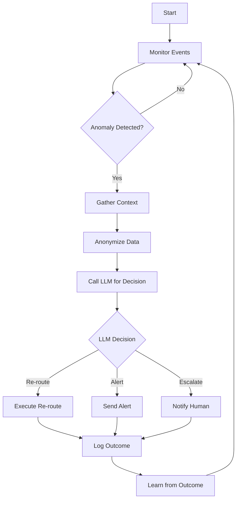

# Logistics AI: Agentic AI (Кот ИИ)

**Версия:** 1.0  
**Дата:** 18.04.2026  
**Автор:** CatVRF AI Sensei  
**Статус:** Production Ready

---

## Оглавление

1. [Философия Agentic AI](#философия-agentic-ai)
2. [Agent vs Traditional ML](#agent-vs-traditional-ml)
3. [Кот ИИ: Logistics Agent Architecture](#кот-ии-logistics-agent-architecture)
4. [Agent Capabilities](#agent-capabilities)
5. [Инструменты и Frameworks](#инструменты-и-frameworks)
6. [Реализация (по шагам)](#реализация-по-шагам)
7. [Human-in-the-Loop](#human-in-the-loop)
8. [Мониторинг и Safety](#мониторинг-и-safety)

---

## Философия Agentic AI

### Что такое Agentic AI

**Agentic AI** — это AI-система, которая:
- **Автономно принимает решения** на основе контекста
- **Мониторит состояние системы** в реал-тайм
- **Инициирует действия** (re-route, alert, scale) без участия человека
- **Учится на outcome** и адаптируется

### Кот ИИ (Cat AI) для CatVRF

**Кот ИИ** — это logistics agent, который:
- Мониторит аномалии в доставке (задержки, пробки, отмены)
- Принимает решения о re-routing в реал-тайм
- Прогнозирует спрос и предлагает pre-positioning курьеров
- Уведомляет диспетчеров о критических ситуациях
- Работает 24/7 без устали

### Принципы Кот ИИ

1. **Autonomy with Guardrails**: Автономен, но с жесткими ограничениями (max budget, max re-routes/hour)
2. **Explainability**: Каждое решение логируется с reasoning
3. **Fallback**: Если не уверен → escalate to human
4. **Incremental**: Начинаем с simple rules + LLM, потом → full agent
5. **Medical Compliance**: Никаких PII в LLM, анонимизация обязательна

---

## Agent vs Traditional ML

| Аспект | Traditional ML (XGBoost, VRP) | Agentic AI (Кот ИИ) |
|--------|------------------------------|---------------------|
| **Тип задач** | Prediction, Optimization | Decision-making, Planning |
| **Вход** | Статичные фичи | Динамический контекст (events, state) |
| **Выход** | Score, Route | Action (re-route, alert, scale) |
| **Триггер** | Request-based | Event-driven + continuous monitoring |
| **Адаптивность** | Retrain daily/weekly | Real-time adaptation |
| **Объяснение** | Feature importance | Natural language reasoning |
| **Человеческий контроль** | Manual review | Human-in-the-loop for critical decisions |

### Пример: Scenario-Based Comparison

**Сценарий:** Курьер стоит 15 минут на месте, заказ задерживается.

**Traditional ML:**
- ETA prediction model предсказывает новую ETA
- Nothing happens automatically
- Human dispatcher must notice and act

**Agentic AI (Кот ИИ):**
- Agent detects: "courier_id=123 standing for 15min, order_id=456 delayed"
- Agent analyzes: Check traffic, check courier status, check alternative couriers
- Agent decides: "Re-route order to courier_id=789 (2km away, idle)"
- Agent executes: Calls UnifiedFleetService::reRoute()
- Agent notifies: "Re-routed order 456 to courier 789 due to delay"
- Agent learns: Log outcome for future decisions

---

## Кот ИИ: Logistics Agent Architecture

### High-Level Architecture

```
┌─────────────────────────────────────────────────────────────┐
│                    Laravel Backend                          │
│  ┌──────────────────────────────────────────────────────┐  │
│  │  Event Bus (Redis / Laravel Events)                  │  │
│  │  - CourierLocationUpdated                            │  │
│  │  - OrderStatusChanged                                │  │
│  │  - TrafficAlertReceived                              │  │
│  └──────────────────────────────────────────────────────┘  │
│                            │                                │
│                            ▼                                │
│  ┌──────────────────────────────────────────────────────┐  │
│  │  CatAIAgentService (Laravel)                         │  │
│  │  - monitor() — continuous loop                       │  │
│  │  - analyze() — gather context                        │  │
│  │  - decide() — call LLM for decision                  │  │
│  │  - execute() — perform action                        │  │
│  └──────────────────────────────────────────────────────┘  │
└─────────────────────────────────────────────────────────────┘
                            │ HTTP
                            ▼
┌─────────────────────────────────────────────────────────────┐
│              LLM Provider (OpenAI / Grok / Claude)         │
│  - GPT-4 / Claude 3.5 / Grok-2                            │
│  - System prompt: "You are CatVRF logistics agent..."     │
│  - Input: Anonymized context + rules                      │
│  - Output: Decision + reasoning                           │
└─────────────────────────────────────────────────────────────┘
                            │
                            ▼
┌─────────────────────────────────────────────────────────────┐
│                    ClickHouse (Context)                    │
│  - Real-time courier positions                             │
│  - Active orders status                                    │
│  - Traffic data                                            │
│  - Historical patterns                                     │
└─────────────────────────────────────────────────────────────┘
```

### Agent Loop



---

## Agent Capabilities

### 1. Anomaly Detection

**Что мониторит:**
- Курьер стоит > X минут без движения
- ETA prediction error > Y минут
- Внезапный spike отмен в зоне
- Traffic surge > Z%
- Courier battery low < 20%

**Детекция:**

```php
<?php

namespace Modules\GeoLogistics\Services;

class CatAIAgentService
{
    private const COURIER_STUCK_THRESHOLD_MINUTES = 15;
    private const ETA_ERROR_THRESHOLD_MINUTES = 10;
    private const CANCELLATION_SPIKE_THRESHOLD = 5; // 5x normal
    
    public function detectAnomalies(): array
    {
        $anomalies = [];
        
        // Check stuck couriers
        $stuckCouriers = $this->detectStuckCouriers();
        foreach ($stuckCouriers as $courier) {
            $anomalies[] = [
                'type' => 'courier_stuck',
                'severity' => 'high',
                'courier_id' => $courier['id'],
                'duration_minutes' => $courier['duration'],
            ];
        }
        
        // Check ETA errors
        $etaErrors = $this->detectETAErrors();
        foreach ($etaErrors as $error) {
            $anomalies[] = [
                'type' => 'eta_error',
                'severity' => 'medium',
                'order_id' => $error['order_id'],
                'error_minutes' => $error['error'],
            ];
        }
        
        // Check cancellation spikes
        $cancellationSpike = $this->detectCancellationSpike();
        if ($cancellationSpike) {
            $anomalies[] = [
                'type' => 'cancellation_spike',
                'severity' => 'high',
                'zone_id' => $cancellationSpike['zone_id'],
                'rate' => $cancellationSpike['rate'],
            ];
        }
        
        return $anomalies;
    }
    
    private function detectStuckCouriers(): array
    {
        // Query ClickHouse for couriers with no location update > 15min
        // while having active order
        return DB::connection('clickhouse')
            ->table('logistics_courier_locations_raw')
            ->where('status', 'busy')
            ->where('recorded_at', '<', now()->subMinutes(self::COURIER_STUCK_THRESHOLD_MINUTES))
            ->get()
            ->toArray();
    }
}
```

### 2. Context Gathering

**Собирает контекст для LLM:**

```php
private function gatherContext(array $anomaly): array
{
    $context = [
        'anomaly' => $anomaly,
        'timestamp' => now()->toIso8601String(),
    ];
    
    match ($anomaly['type']) {
        'courier_stuck' => $context = array_merge($context, [
            'courier_info' => $this->getCourierInfo($anomaly['courier_id']),
            'current_orders' => $this->getCourierOrders($anomaly['courier_id']),
            'nearby_couriers' => $this->getNearbyCouriers($anomaly['courier_id']),
            'traffic_data' => $this->getTrafficData($anomaly['courier_id']),
        ]),
        'eta_error' => $context = array_merge($context, [
            'order_info' => $this->getOrderInfo($anomaly['order_id']),
            'route_info' => $this->getRouteInfo($anomaly['order_id']),
            'traffic_data' => $this->getTrafficDataForRoute($anomaly['order_id']),
        ]),
        'cancellation_spike' => $context = array_merge($context, [
            'zone_info' => $this->getZoneInfo($anomaly['zone_id']),
            'recent_cancellations' => $this->getRecentCancellations($anomaly['zone_id']),
            'zone_load' => $this->getZoneLoad($anomaly['zone_id']),
        ]),
    };
    
    return $context;
}
```

### 3. Anonymization (Critical for Compliance)

**Удаляет PII перед отправкой в LLM:**

```php
private function anonymizeContext(array $context): array
{
    $anonymized = $context;
    
    // Remove PII fields
    unset($anonymized['courier_info']['name']);
    unset($anonymized['courier_info']['phone']);
    unset($anonymized['courier_info']['email']);
    unset($anonymized['order_info']['user_name']);
    unset($anonymized['order_info']['user_phone']);
    unset($anonymized['order_info']['user_address']);
    
    // Hash IDs
    $anonymized['courier_id'] = hash('sha256', (string) $context['courier_id']);
    $anonymized['order_id'] = hash('sha256', (string) $context['order_id']);
    
    return $anonymized;
}
```

### 4. LLM Decision Making

**Вызывает LLM для принятия решения:**

```php
private function makeDecision(array $anonymizedContext): array
{
    $systemPrompt = <<<'PROMPT'
You are CatVRF Logistics AI Agent (Кот ИИ). You monitor delivery operations and make decisions to optimize logistics.

Your capabilities:
1. Re-route orders to alternative couriers
2. Send alerts to dispatchers
3. Escalate critical issues to humans
4. Suggest courier pre-positioning

Rules:
- NEVER include PII in your reasoning
- Always explain your decision with 2-3 sentences
- If confidence < 70%, escalate to human
- Max 1 re-route per courier per 10 minutes
- Max cost increase: 15% per re-route

Response format (JSON):
{
  "decision": "re_route" | "alert" | "escalate" | "no_action",
  "confidence": 0.0-1.0,
  "reasoning": "string",
  "action_params": {
    "target_courier_id": "hash",
    "new_eta_minutes": 123
  }
}
PROMPT;

    $userPrompt = json_encode($anonymizedContext, JSON_PRETTY_PRINT);
    
    $response = $this->llmClient->chat()->create([
        'model' => 'gpt-4-turbo',
        'messages' => [
            ['role' => 'system', 'content' => $systemPrompt],
            ['role' => 'user', 'content' => $userPrompt],
        ],
        'temperature' => 0.3,  // Low temperature for consistent decisions
        'max_tokens' => 500,
    ]);
    
    $decision = json_decode($response->choices[0]->message->content, true);
    
    // Validate decision
    if (!$this->validateDecision($decision)) {
        return [
            'decision' => 'escalate',
            'confidence' => 0.0,
            'reasoning' => 'Invalid decision format from LLM',
            'action_params' => [],
        ];
    }
    
    return $decision;
}
```

### 5. Action Execution

**Выполняет решение:**

```php
private function executeAction(array $decision, array $originalContext): void
{
    match ($decision['decision']) {
        're_route' => $this->executeReRoute($decision, $originalContext),
        'alert' => $this->sendAlert($decision, $originalContext),
        'escalate' => $this->escalateToHuman($decision, $originalContext),
        'no_action' => $this->logNoAction($decision, $originalContext),
    };
}

private function executeReRoute(array $decision, array $context): void
{
    $courierId = $context['courier_id'];
    $targetCourierHash = $decision['action_params']['target_courier_id'];
    
    // Find actual courier ID from hash (internal mapping)
    $targetCourierId = $this->resolveCourierFromHash($targetCourierHash);
    
    // Call UnifiedFleetService
    try {
        $this->unifiedFleetService->reRouteOrder(
            orderId: $context['order_id'],
            fromCourierId: $courierId,
            toCourierId: $targetCourierId,
        );
        
        $this->log->channel('audit')->info('cat_ai.re_route_executed', [
            'correlation_id' => $this->correlationId,
            'order_id' => $context['order_id'],
            'from_courier' => $courierId,
            'to_courier' => $targetCourierId,
            'reasoning' => $decision['reasoning'],
            'confidence' => $decision['confidence'],
        ]);
        
        // Notify couriers via WebSocket
        event(new OrderReRouted($context['order_id'], $targetCourierId));
    } catch (\Throwable $e) {
        $this->log->channel('audit')->error('cat_ai.re_route_failed', [
            'error' => $e->getMessage(),
            'context' => $context,
        ]);
        
        // Fallback: escalate
        $this->escalateToHuman($decision, $context);
    }
}
```

---

## Инструменты и Frameworks

### Option 1: Direct LLM API (Simplest)

**Плюсы:**
- Простой, быстрый старт
- Никаких дополнительных зависимостей
- Гибкость в выборе провайдера (OpenAI, Grok, Claude)

**Минусы:**
- Нет встроенного memory/state management
- Нужно самим реализовывать tool calling

**Реализация:** Как показано выше (прямой HTTP вызов LLM API)

### Option 2: LangChain (Recommended)

**Плюсы:**
- Tool calling (автоматический вызов функций)
- Memory management (конвертации с агентом)
- Agents с разной логикой (ReAct, Plan-and-Execute)
- Поддержка множества LLM провайдеров

**Минусы:**
- Дополнительная зависимость (Python)
- Learning curve

**Пример (Python LangChain):**

```python
from langchain.agents import AgentExecutor, create_openai_tools_agent
from langchain_openai import ChatOpenAI
from langchain.tools import tool
from langchain_core.prompts import ChatPromptTemplate

# Define tools
@tool
def re_route_order(order_id: str, from_courier_id: str, to_courier_id: str) -> str:
    """Re-route an order from one courier to another."""
    # Call Laravel API
    response = requests.post(
        'http://laravel/api/v1/logistics/re-route',
        json={'order_id': order_id, 'from_courier_id': from_courier_id, 'to_courier_id': to_courier_id}
    )
    return response.json()

@tool
def send_alert(message: str, severity: str) -> str:
    """Send alert to dispatchers."""
    # Send to Slack/Telegram
    return f"Alert sent: {message}"

@tool
def get_courier_info(courier_id: str) -> dict:
    """Get courier information."""
    # Query Laravel API
    response = requests.get(f'http://laravel/api/v1/logistics/couriers/{courier_id}')
    return response.json()

# Create LLM
llm = ChatOpenAI(model="gpt-4-turbo", temperature=0.3)

# Create agent
tools = [re_route_order, send_alert, get_courier_info]
prompt = ChatPromptTemplate.from_messages([
    ("system", "You are CatVRF Logistics AI Agent. Use tools to make decisions."),
    ("human", "{input}"),
    ("placeholder", "{agent_scratchpad}"),
])

agent = create_openai_tools_agent(llm, tools, prompt)
agent_executor = AgentExecutor(agent=agent, tools=tools, verbose=True)

# Run
result = agent_executor.invoke({
    "input": "Courier 123 is stuck for 15 minutes with order 456. What should I do?"
})
```

### Option 3: LlamaIndex (For RAG)

**Плюсы:**
- Отличен для RAG (retrieval-augmented generation)
- Встроенные vector stores
- Хороший для query over historical data

**Минусы:**
- Более сложный для простых decision-making задач

**Когда использовать:** Если нужно query исторические данные (например, "What did we do last time this happened?")

### Рекомендация для CatVRF

**Phase 1 (Week 1-4):** Direct LLM API
- Простой, быстрый старт
- Поймем паттерны решений

**Phase 2 (Week 5-8):** LangChain
- Добавим tool calling
- Улучшим memory management

**Phase 3 (Week 9+):** LlamaIndex (опционально)
- Добавим RAG для исторических решений
- Query over past anomalies

---

## Реализация (по шагам)

### Неделя 1: Foundation

1. **Создать Service**:
   ```php
   // Modules/GeoLogistics/Services/CatAIAgentService.php
   ```

2. **Создать Events**:
   - `AnomalyDetected`
   - `AgentDecisionMade`
   - `AgentActionExecuted`

3. **Настроить LLM client**:
   ```php
   // config/cat_ai.php
   return [
       'llm_provider' => env('CAT_AI_LLM_PROVIDER', 'openai'),
       'openai_api_key' => env('OPENAI_API_KEY'),
       'model' => env('CAT_AI_MODEL', 'gpt-4-turbo'),
       'max_tokens' => 500,
       'temperature' => 0.3,
   ];
   ```

4. **Создать Command для мониторинга**:
   ```php
   // app/Console/Commands/CatAIMonitorCommand.php
   php artisan cat_ai:monitor
   ```

### Неделя 2: Anomaly Detection

1. **Реализовать detectAnomalies()**:
   - Stuck couriers
   - ETA errors
   - Cancellation spikes

2. **Добавить в ClickHouse queries**:
   - Оптимизировать queries для реал-тайм

3. **Тестирование**:
   - Unit тесты для детекции
   - Mock данные для аномалий

### Неделя 3: LLM Integration

1. **Реализовать makeDecision()**:
   - System prompt
   - Context gathering
   - Anonymization
   - LLM call

2. **Реализовать validateDecision()**:
   - Проверка формата
   - Проверка confidence threshold
   - Проверка business rules

3. **Тестирование**:
   - Unit тесты с mock LLM
   - Интеграционные тесты с реальным LLM

### Неделя 4: Action Execution

1. **Реализовать executeAction()**:
   - re_route
   - alert
   - escalate

2. **Интеграция с UnifiedFleetService**:
   - Вызов re-route

3. **WebSocket events**:
   - Notify couriers
   - Notify dispatchers

### Неделя 5: Human-in-the-Loop

1. **Создать Filament ресурс**:
   - `AgentDecisionResource` — просмотр всех решений
   - Фильтры по типу, severity, confidence

2. **Создать approval workflow**:
   - Критические решения требуют approval
   - Кнопка "Approve" / "Reject"

3. **Уведомления**:
   - Slack/Telegram для escalate cases

### Неделя 6: Monitoring & Learning

1. **Prometheus metrics**:
   - `cat_ai_anomalies_detected_total`
   - `cat_ai_decisions_made_total`
   - `cat_ai_actions_executed_total`
   - `cat_ai_llm_latency_seconds`

2. **Grafana dashboard**:
   - Anomalies over time
   - Decision distribution
   - Action success rate

3. **Outcome logging**:
   - Логировать actual outcome (удалось ли re-route?)
   - Использовать для future learning

### Неделя 7-8: Advanced Features

1. **Memory/Context window**:
   - Хранить последние N решений в memory
   - Использовать для контекста

2. **Tool calling (LangChain)**:
   - Перейти на LangChain для tool calling
   - Улучшить reasoning

3. **RAG (LlamaIndex)**:
   - Добавить vector store для исторических решений
   - Query: "What did we do last time?"

---

## Human-in-the-Loop

### Когда нужен human approval

**Всегда escalate для:**
- Confidence < 70%
- Cost increase > 15%
- Re-route > 3 orders за 10 минут
- Критические зоны (emergency orders)
- Первые 2 недели работы (learning mode)

### Filament Dashboard

```php
<?php

namespace Modules\GeoLogistics\Filament\Resources;

use Filament\Forms;
use Filament\Tables;
use Filament\Resources\Resource;

class AgentDecisionResource extends Resource
{
    protected static ?string $model = AgentDecision::class;
    protected static ?string $navigationIcon = 'heroicon-o-robot';
    
    public static function table(Table $table): Table
    {
        return $table
            ->columns([
                Tables\Columns\TextColumn::make('created_at')
                    ->dateTime(),
                Tables\Columns\TextColumn::make('anomaly_type'),
                Tables\Columns\TextColumn::make('decision'),
                Tables\Columns\TextColumn::make('confidence')
                    ->formatStateUsing(fn ($state) => $state * 100 . '%'),
                Tables\Columns\TextColumn::make('reasoning')
                    ->limit(50),
                Tables\Columns\BadgeColumn::make('status')
                    ->colors([
                        'success' => 'executed',
                        'warning' => 'pending_approval',
                        'danger' => 'rejected',
                    ]),
            ])
            ->filters([
                Tables\Filters\SelectFilter::make('decision')
                    ->options([
                        're_route' => 'Re-route',
                        'alert' => 'Alert',
                        'escalate' => 'Escalate',
                    ]),
                Tables\Filters\Filter::make('low_confidence')
                    ->query(fn ($query) => $query->where('confidence', '<', 0.7)),
            ])
            ->actions([
                Tables\Actions\ApproveAction::make(),
                Tables\Actions\RejectAction::make(),
            ]);
    }
}
```

### Approval Workflow

```php
<?php

namespace Modules\GeoLogistics\Actions;

class ApproveAgentDecision
{
    public function execute(AgentDecision $decision): void
    {
        if ($decision->status !== 'pending_approval') {
            throw new \Exception('Decision not pending approval');
        }
        
        // Execute action
        app(CatAIAgentService::class)->executeAction(
            $decision->decision_data,
            $decision->context_data
        );
        
        // Update status
        $decision->update([
            'status' => 'executed',
            'approved_by' => auth()->id(),
            'approved_at' => now(),
        ]);
    }
}
```

---

## Мониторинг и Safety

### Prometheus Metrics

```php
// In CatAIAgentService
use Prometheus\CollectorRegistry;

private function recordMetrics(array $anomaly, array $decision): void
{
    $registry = app(CollectorRegistry::class);
    
    $registry->getOrRegisterCounter(
        'catvrf',
        'cat_ai_anomalies_detected_total',
        'Total anomalies detected',
        ['type']
    )->inc([$anomaly['type']]);
    
    $registry->getOrRegisterCounter(
        'catvrf',
        'cat_ai_decisions_made_total',
        'Total decisions made',
        ['decision']
    )->inc([$decision['decision']]);
    
    $registry->getOrRegisterGauge(
        'catvrf',
        'cat_ai_confidence_score',
        'Decision confidence score'
    )->set($decision['confidence']);
    
    $registry->getOrRegisterHistogram(
        'catvrf',
        'cat_ai_llm_latency_seconds',
        'LLM call latency'
    )->observe($this->llmLatency);
}
```

### Safety Guards

```php
class SafetyGuard
{
    private const MAX_RE_ROUTES_PER_10MIN = 3;
    private const MAX_COST_INCREASE_PCT = 15;
    private const MIN_CONFIDENCE = 0.7;
    
    public function canExecuteAction(array $decision, array $context): bool
    {
        // Check confidence
        if ($decision['confidence'] < self::MIN_CONFIDENCE) {
            return false;
        }
        
        // Check cost increase
        if ($decision['decision'] === 're_route') {
            $costIncrease = $this->calculateCostIncrease($decision, $context);
            if ($costIncrease > self::MAX_COST_INCREASE_PCT) {
                return false;
            }
        }
        
        // Check rate limit
        if ($decision['decision'] === 're_route') {
            $recentReRoutes = $this->getRecentReRoutes($context['courier_id'], 10);
            if ($recentReRoutes >= self::MAX_RE_ROUTES_PER_10MIN) {
                return false;
            }
        }
        
        return true;
    }
}
```

### Alerting

```yaml
# alerts.yml
groups:
  - name: cat_ai
    rules:
      - alert: CatAIConfidenceLow
        expr: cat_ai_confidence_score < 0.7
        for: 5m
        annotations:
          summary: "Cat AI making low-confidence decisions"
          
      - alert: CatAIAnomalySpike
        expr: rate(cat_ai_anomalies_detected_total[5m]) > 10
        for: 2m
        annotations:
          summary: "Cat AI detecting anomaly spike"
          
      - alert: CatAILatencyHigh
        expr: cat_ai_llm_latency_seconds > 10
        for: 5m
        annotations:
          summary: "Cat AI LLM latency too high"
```

---

## Итог

**Архитектура Кот ИИ:**
- ✅ Laravel Service для agent logic
- ✅ Event-driven anomaly detection
- ✅ LLM integration (OpenAI/Grok/Claude)
- ✅ Anonymization для compliance
- ✅ Tool calling (re-route, alert, escalate)
- ✅ Human-in-the-loop (Filament dashboard)
- ✅ Safety guards (confidence, cost, rate limits)
- ✅ Prometheus metrics + Grafana dashboards

**Ожидаемый результат:**
- Автоматическое re-routing для 80% stuck courier cases
- Снижение delivery delays на 20-30%
- Время реакции на аномалии: < 1 минута
- Human intervention только для 10-20% cases

**Roadmap:**
- **Phase 1 (Week 1-4):** Direct LLM API + basic anomaly detection
- **Phase 2 (Week 5-8):** LangChain + tool calling
- **Phase 3 (Week 9+):** RAG + historical decision learning

**Следующие шаги:**
1. Implement CatAIAgentService
2. Set up LLM API keys
3. Create Filament dashboard for human-in-the-loop
4. Deploy in shadow mode (monitor without executing)
5. Gradual rollout with safety guards

---

## Полный стек документации

- [Data & ClickHouse](LOGISTICS_AI_DATA_CLICKHOUSE.md) — Схема данных и pipeline
- [Route Optimization](LOGISTICS_AI_ROUTE_OPTIMIZATION.md) — VRP solver + ML hybrid
- [Agentic AI (Кот ИИ)](LOGISTICS_AI_AGENTIC.md) — Этот документ
